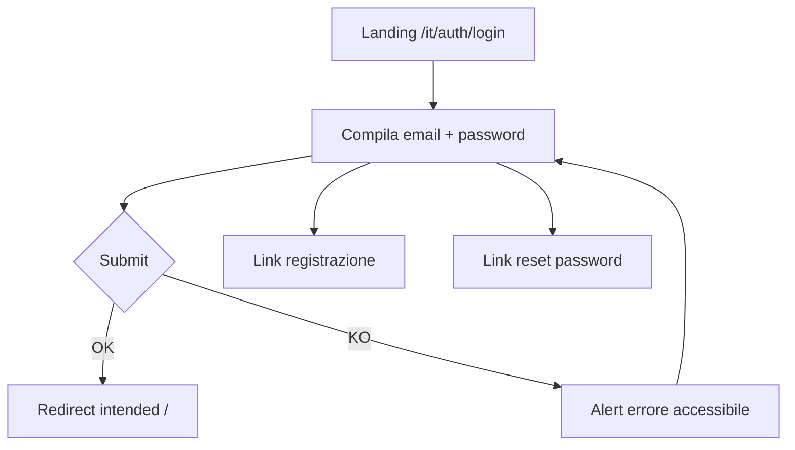

# UX design — `/it/auth/login` (accessibilità e CTA)

**URL:** `http://127.0.0.1:8000/it/auth/login`  
**WCAG target:** 2.1 Level AA (FixCity PA)  
**Data analisi:** 2026-06-04  
**Piattaforme:** Web desktop, tablet, mobile

---

## User flow

---

## Problema segnalato (UI/UX + WCAG)

| Sintomo | Causa radice | Impatto |
|---------|--------------|---------|
| Bottone submit **marrone** (“cacca”) con **testo nero** | `Color::Amber` in `MetatagData` / `FrontPanelProvider` → `--primary-*` Filament ambra | Risolto: `PaDesignColors` verde PA `#007A52` + `getAllColors()` sui panel |

**Regola FO:** con palette PA attiva, `bg-primary-600` + `text-white` sul login è coerente con backoffice.

---

## Design tokens CTA (correzione)

| Token | Valore | Uso |
|-------|--------|-----|
| CTA submit | `<x-filament::button color="primary">` | `PaDesignColors` — no hex in `14-auth-login.css` |
| Campi form | `.fo-filament-form-shell` | Token `--fixcity-field-border` / focus `--fixcity-primary` |
| Testo CTA | `#FFFFFF` | Label submit |
| Altezza min | 44px | Target touch WCAG 2.5.5 |

SSoT Filament: `Modules/Xot/Support/PaDesignColors.php`.

---

## Accessibility annotations

### Submit (dopo fix)

| Requisito | Stato | Nota |
|-----------|--------|------|
| Contrasto testo 4.5:1 | Pass | `#FFFFFF` su `#007A52` (primary PA) |
| Focus visibile | Pass | `focus-visible:ring-italia-blue` + outline CSS |
| Nome accessibile | Pass | Testo da `user::auth.login.submit` |
| Touch target 44px | Pass | `min-h-[44px]` |
| Stato disabled | Pass | `disabled:opacity-50` + `aria` via wire:loading |

### Form

| Elemento | Annotazione |
|----------|-------------|
| Email / password | Label da `user::login_widget` (LangServiceProvider) |
| Errore login | `role="alert"` + `aria-live="assertive"` |
| Form | `aria-labelledby="auth-login-heading"` |

### Link secondari

- Registrazione / reset: `text-italia-blue` (non `text-primary-700` amber).

---

## Validazione eseguita (2026-06-04)

### pa11y (WCAG2AA, locale)

Comando: `pa11y http://127.0.0.1:8000/it/auth/login --standard WCAG2AA --reporter cli`

| Esito | Dettaglio |
|-------|-----------|
| `DEBUGBAR_ENABLED=false` | **No issues found!** (2026-06-04) |

### Google PageSpeed Insights

| Stato | Nota |
|-------|------|
| Non eseguito in CI | `GOOGLE_API_KEY` assente in ambiente dev |
| Prossimo passo | STORY-137 — `pagespeed-insights-mcp` su URL staging pubblico |

### MAUVE++

| Stato | Nota |
|-------|------|
| Manuale | [MAUVE++](https://mauve.isti.cnr.it/) — valutazione singola pagina su host raggiungibile (non `127.0.0.1` senza tunnel) |

---

## Developer handoff

| File | Modifica |
|------|----------|
| `resources/views/filament/widgets/auth/login.blade.php` | `fo-filament-form-shell` + `x-filament::button color="primary"`; link `italia-blue` |
| `resources/css/app/14-auth-login.css` | Solo layout pagina (no hex CTA) |
| `resources/css/components/fo-filament-form-shell.css` | Bordi/focus via `--fixcity-*` |
| `docs/wiki/concepts/auth-login-ux-fixes.md` | Riga root cause |

**Build:** `cd laravel/Themes/Sixteen && npm run build` (o `build:copy`) prima di verifica visiva.

**Architettura:** [fo-pa-tokens-uniformity.md](../../architecture/fo-pa-tokens-uniformity.md) · [filament-pa-design-colors.md](../../../../Modules/Xot/docs/wiki/concepts/filament-pa-design-colors.md)

---

## Collegamenti

- [auth-login-ux-fixes.md](../concepts/auth-login-ux-fixes.md)
- [mcp-validation-quality-gate.md](../../../../../docs/wiki/mcp-validation-quality-gate.md)
- [STORY-137](../../../../../docs/stories/STORY-137-mcp-validation-mauve-pagespeed-gsc.md)
- [ux-design-fixcity.md](../../../../../docs/ux-design-fixcity.md)
