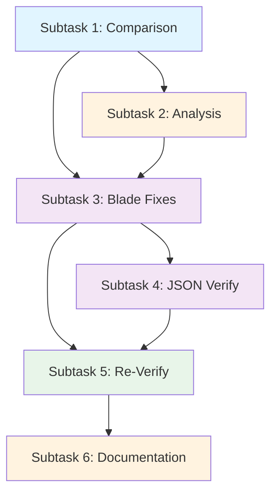

# 🚀 GSD PHASE 1 - EXECUTION PLAN

**Type**: GSD Phase Execution Plan  
**Goal**: Achieve 90% HTML structural parity for segnalazioni-elenco  
**Pilot**: segnalazioni-elenco (leads to scaling all pages)  
**Timeline**: Concurrent multi-agent execution  
**Status**: 🟢 Ready for Execution  

---

## 📋 PHASE OVERVIEW

### Phase Goal
Align FixCity Sixteen theme HTML body structure with Design Comuni reference to achieve ≥90% structural parity on pilot page (segnalazioni-elenco), establishing methodology for scaling to all 49 test pages.

### Success Criteria
- ✅ Parity score ≥ 90%
- ✅ All semantic elements present
- ✅ Bootstrap classes match reference
- ✅ ARIA attributes correct
- ✅ No hardcoded text in blade
- ✅ Translation keys follow pattern
- ✅ Comparison report preserved
- ✅ Findings documented

### Dependencies
- ✅ PHASE-1-STRATEGY.md completed
- ✅ bashscripts/html/html-structure-compare.sh functional
- ✅ bashscripts/html/ helper scripts ready
- ⏳ Laravel dev server running
- ⏳ Executor agents available

---

## 🎯 SUBTASKS & AGENT ASSIGNMENTS

### Subtask 1: Comparison (EXECUTOR #1)

**Agent**: Executor - HTML Comparison & Analysis  
**Status**: 🔲 Pending  
**Estimated Time**: 15-20 minutes  

#### Task Description
Run HTML body structure comparison between Design Comuni reference and FixCity local implementation.

#### Prerequisites
```bash
# Ensure Laravel dev server running
cd /var/www/_bases/base_fixcity_fila5/laravel
php artisan serve --host=127.0.0.1 --port=8000

# Verify page accessible
curl -I http://127.0.0.1:8000/it/tests/segnalazioni-elenco
```

#### Execution Steps

**Step 1.1**: Navigate to project root
```bash
cd /var/www/_bases/base_fixcity_fila5
```

**Step 1.2**: Run comparison script
```bash
./bashscripts/html/html-structure-compare.sh segnalazioni-elenco
```

**Step 1.3**: Monitor output
Script will:
- Fetch reference HTML from Italia.github.io
- Fetch local HTML from localhost:8000
- Extract BODY elements (no scripts/styles)
- Compare structures element-by-element
- Generate reports to `laravel/Themes/Sixteen/docs/body-structure-comparison/segnalazioni-elenco/`

**Step 1.4**: Verify success
Check for:
- ✅ No errors in script output
- ✅ Both reference and local HTML fetched
- ✅ BODY extracted from both
- ✅ Comparison report generated
- ✅ Parity score displayed

#### Expected Output
```
laravel/Themes/Sixteen/docs/body-structure-comparison/segnalazioni-elenco/
├── comparison-report.json          (machine-readable: full technical data)
├── parity-summary.txt              (human-readable: summary and next steps)
├── reference-body.html             (extracted reference structure)
└── local-body.html                 (extracted local structure)
```

#### Report Interpretation
Open `parity-summary.txt`:
- Look for: `📊 Parity Score: XX%`
- If ≥ 90% → Gap 2 (analysis only)
- If 70-89% → Gap 2 (analysis) → Gap 3 (fixes)
- If < 70% → Major structural differences, needs deep investigation

#### Deliverable
✅ Comparison report ready for analysis

#### Handoff to Researcher
Share:
1. Parity score percentage
2. Count of missing elements
3. Count of extra elements
4. Key findings summary

---

### Subtask 2: Analysis & Gap Documentation (RESEARCHER)

**Agent**: Researcher - Analysis & Documentation  
**Status**: 🔲 Pending (awaits Subtask 1)  
**Estimated Time**: 20-30 minutes  

#### Task Description
Analyze comparison report, map findings to reference structure, document detailed gaps and fix recommendations.

#### Prerequisites
- ✅ Subtask 1 completed
- ✅ comparison-report.json available
- ✅ parity-summary.txt readable

#### Input Files
```
laravel/Themes/Sixteen/docs/body-structure-comparison/segnalazioni-elenco/
├── comparison-report.json
├── parity-summary.txt
├── reference-body.html
└── local-body.html
```

#### Execution Steps

**Step 2.1**: Read comparison report
```bash
cd /var/www/_bases/base_fixcity_fila5
cat laravel/Themes/Sixteen/docs/body-structure-comparison/segnalazioni-elenco/parity-summary.txt
```

**Step 2.2**: Parse detailed findings
```bash
jq '.differences' laravel/Themes/Sixteen/docs/body-structure-comparison/segnalazioni-elenco/comparison-report.json | head -100
```

**Step 2.3**: Identify gap categories
Categorize missing elements:
- Missing semantic elements (section, article, aside, nav)
- Missing class names (Bootstrap grid, component classes)
- Missing ARIA attributes (role, aria-label, aria-selected)
- Missing form structure (checkboxes, labels)
- Extra elements (Tailwind divs, non-semantic wrappers)

**Step 2.4**: Create PHASE-1-FINDINGS.md
Document:
1. Parity score summary
2. Categorized gaps (semantic, classes, ARIA, forms)
3. For EACH gap:
   - What's missing in local
   - Where it should be in reference
   - Estimated complexity to fix (1-3 difficulty)
   - Suggested fix approach
4. Prioritized fix list
5. Estimated total fix time

#### Example Gap Documentation
```markdown
## Gap 1: Missing Hero Section [CRITICAL]

**Location**: After `<main>` element  
**Reference**: `<section id="head-section">` with featured card  
**FixCity**: Currently missing entire section  
**Complexity**: Medium (3/5)

**What's Missing**:
- [ ] `<section id="head-section">`
- [ ] Featured card component with image
- [ ] Category badge
- [ ] Date display
- [ ] Bootstrap grid structure

**Fix Approach**:
1. Add `<x-blocks.featured-card />` component call
2. Pass featured item data from JSON
3. Ensure Bootstrap classes: `.container`, `.row`, `.col-12`

**Impact**: High - affects visual parity significantly
```

#### Deliverable
✅ PHASE-1-FINDINGS.md with:
- Complete gap inventory
- Prioritized fix list
- Time estimates
- Fix recommendations

#### Handoff to Executor #2
Share:
1. Prioritized fix list
2. Code examples for each gap
3. File locations to modify
4. Translation keys needed

---

### Subtask 3: Blade Template Fixes (EXECUTOR #2)

**Agent**: Executor - Code Implementation  
**Status**: 🔲 Pending (awaits Subtask 2)  
**Estimated Time**: 40-60 minutes  

#### Task Description
Apply HTML structural fixes to blade template and block components based on gap analysis.

#### Prerequisites
- ✅ PHASE-1-FINDINGS.md complete
- ✅ Detailed gap list available
- ✅ Fix recommendations provided

#### Files to Modify (Do NOT Create New Files)
```
PRIMARY (Modify, do not create):
  laravel/Themes/Sixteen/resources/views/pages/tests/[slug].blade.php
  
SECONDARY (Update components):
  laravel/Themes/Sixteen/resources/views/components/blocks/segnalazioni/layout.blade.php
  laravel/Themes/Sixteen/resources/views/components/blocks/segnalazioni/featured.blade.php (create if needed)
  laravel/Themes/Sixteen/resources/views/components/blocks/segnalazioni/filters.blade.php (create if needed)
  
DO NOT CREATE:
  ❌ laravel/Themes/Sixteen/resources/views/pages/tests/segnalazioni-elenco.blade.php
  ❌ Page-specific blades (use [slug].blade.php with parameter)
```

#### Execution Steps

**Step 3.1**: Study gap priorities
Review PHASE-1-FINDINGS.md, start with HIGH priority gaps

**Step 3.2**: For EACH gap:

A. **Understand the reference structure**
   - Study reference-body.html from comparison output
   - Find the reference element/section
   - Note its structure, classes, attributes

B. **Locate fix location**
   - Open [slug].blade.php or block component
   - Find where this element should be rendered
   - Note: content comes from JSON, structure from blade

C. **Apply fix**
   - Add correct HTML structure
   - Ensure all Bootstrap classes present
   - Add ARIA attributes
   - Use `trans()` for any text/labels
   - Reference JSON data via `$data` array

D. **Example Fix - Hero Section**

Before (missing):
```blade
<!-- Nothing here -->
```

After (with structure):
```blade
@if (isset($data['featured_item']))
  <section id="head-section" class="section-hero">
    <div class="container">
      <div class="row">
        <div class="col-12">
          <x-cards.featured 
            :item="$data['featured_item']" 
            :image="$data['featured_item']['image'] ?? null"
          />
        </div>
      </div>
    </div>
  </section>
@endif
```

E. **Check translations**
   - Every user-visible text must use `trans()`
   - Pattern: `trans('fixcity::segnalazione.fields.title.label')`
   - Create translation keys in `laravel/lang/*/fixcity.php`

**Step 3.3**: Build and verify
```bash
cd laravel/Themes/Sixteen
npm run build
npm run copy
php artisan optimize:clear
```

**Step 3.4**: Visually inspect
```bash
# Open in browser
http://127.0.0.1:8000/it/tests/segnalazioni-elenco
```

Check:
- ✅ Structure looks closer to reference
- ✅ Sections visible
- ✅ No console errors
- ✅ No broken layouts

#### Deliverable
✅ Updated blade template with:
- All high-priority gaps fixed
- Correct HTML structure
- Proper Bootstrap classes
- ARIA attributes present
- Translation keys used throughout
- No hardcoded text

#### Handoff to Executor #1 (Verification)
Notify completion, ready for re-comparison

---

### Subtask 4: JSON Content Structure (EXECUTOR #2 or Parallel)

**Agent**: Executor - Code Implementation  
**Status**: 🔲 Pending (parallel with Subtask 3)  
**Estimated Time**: 15-20 minutes  

#### Task Description
Ensure JSON content file has all necessary data structure to support blade template.

#### File to Review/Update
```
laravel/config/local/fixcity/database/content/pages/tests.segnalazioni-elenco.json
```

#### Execution Steps

**Step 4.1**: Review current JSON structure
```bash
cat laravel/config/local/fixcity/database/content/pages/tests.segnalazioni-elenco.json | jq '.'
```

**Step 4.2**: Verify all sections present
- [ ] `featured_item` or similar (for hero section)
- [ ] `tabs` array (for tab navigation)
- [ ] `filters` object (for sidebar filters)
- [ ] `items` array (for card list)
- [ ] `cta` object (call-to-action)
- [ ] `contacts` info (contact section)

**Step 4.3**: Add missing sections if needed
Example structure to ensure present:
```json
{
  "content_blocks": {
    "it": [
      {
        "type": "segnalazioni-layout",
        "data": {
          "view": "pub_theme::components.blocks.segnalazioni.layout",
          "featured_item": { /* hero data */ },
          "tabs": [ /* tab definitions */ ],
          "filters": { /* filter categories */ },
          "items": [ /* segnalazione cards */ ],
          "cta": { /* call-to-action */ },
          "contacts": [ /* contact links */ ]
        }
      }
    ]
  }
}
```

**Step 4.4**: Verify JSON validity
```bash
php -r "json_decode(file_get_contents('laravel/config/local/fixcity/database/content/pages/tests.segnalazioni-elenco.json'), true) or exit(1); echo 'Valid JSON';"
```

#### Deliverable
✅ Updated JSON file with:
- Complete data structure
- All sections present
- Valid JSON syntax
- Ready for blade rendering

---

### Subtask 5: Verification & Re-comparison (EXECUTOR #1)

**Agent**: Executor - HTML Comparison & Analysis  
**Status**: 🔲 Pending (awaits Subtask 3 & 4)  
**Estimated Time**: 15-20 minutes  

#### Task Description
Re-run comparison script after fixes applied. Verify ≥90% parity achieved.

#### Execution Steps

**Step 5.1**: Ensure build complete
```bash
cd /var/www/_bases/base_fixcity_fila5/laravel/Themes/Sixteen
npm run build && npm run copy
cd /var/www/_bases/base_fixcity_fila5
php artisan optimize:clear
```

**Step 5.2**: Re-run comparison
```bash
./bashscripts/html/html-structure-compare.sh segnalazioni-elenco
```

**Step 5.3**: Review new parity score
```bash
cat laravel/Themes/Sixteen/docs/body-structure-comparison/segnalazioni-elenco/parity-summary.txt
jq '.summary' laravel/Themes/Sixteen/docs/body-structure-comparison/segnalazioni-elenco/comparison-report.json
```

**Step 5.4**: Evaluate results

**IF Parity ≥ 90% ✅**:
- Success! Move to documentation phase
- Notify Researcher: ready for completion report

**IF Parity 80-89% ⚠️**:
- Good progress, minor gaps remain
- Review remaining gaps in comparison report
- Apply additional fixes
- Re-test

**IF Parity < 80% ❌**:
- Significant issues remain
- Request detailed gap analysis
- May need architecture review

#### Success Criteria
- ✅ Parity score ≥ 90%
- ✅ Missing elements ≤ 5%
- ✅ Extra elements ≤ 5%
- ✅ Page renders without errors
- ✅ Structure visually similar to reference

#### Deliverable
✅ Final comparison report confirming:
- 90%+ parity achieved
- All critical elements present
- Ready for Phase 2 (CSS)

---

### Subtask 6: Documentation & Index Update (RESEARCHER)

**Agent**: Researcher - Documentation  
**Status**: 🔲 Pending (awaits Subtask 5)  
**Estimated Time**: 20-25 minutes  

#### Task Description
Create completion report, update documentation indices, prepare Phase 2 strategy.

#### Prerequisites
- ✅ Subtask 5 completed
- ✅ Parity ≥ 90% verified
- ✅ Comparison reports available

#### Execution Steps

**Step 6.1**: Create completion report
File: `laravel/Themes/Sixteen/docs/PHASE-1-COMPLETION-REPORT.md`

Content:
```markdown
# Phase 1 Completion Report

## Summary
- **Page**: segnalazioni-elenco (pilot)
- **Parity Score**: XX% ✅
- **Start Date**: YYYY-MM-DD
- **End Date**: YYYY-MM-DD
- **Status**: ✅ COMPLETE

## What Was Fixed
- [List of all gaps fixed]
- [Elements added]
- [Classes corrected]
- [ARIA attributes added]

## Metrics
- Reference elements: XXX
- Local elements: XXX
- Identical: XXX
- Missing: X
- Extra: X

## Files Modified
- laravel/Themes/Sixteen/resources/views/pages/tests/[slug].blade.php
- laravel/config/local/fixcity/database/content/pages/tests.segnalazioni-elenco.json
- laravel/Themes/Sixteen/resources/views/components/blocks/segnalazioni/layout.blade.php

## Lessons Learned
- [Key insights for scaling to other pages]
- [Reusable patterns identified]
- [Time estimates for future pages]

## Next Steps (Phase 2)
- Apply CSS styling (Tailwind → Bootstrap Italia)
- Implement JavaScript behavior
- Accessibility testing
```

**Step 6.2**: Update theme docs index
File: `laravel/Themes/Sixteen/docs/00-INDEX.md`

Add section:
```markdown
## Phase 1: HTML Structure Alignment ✅ COMPLETE

- [PHASE-1-STRATEGY.md](PHASE-1-STRATEGY.md) - Strategy & architecture analysis
- [PHASE-1-FINDINGS.md](PHASE-1-FINDINGS.md) - Detailed gap analysis
- [PHASE-1-COMPLETION-REPORT.md](PHASE-1-COMPLETION-REPORT.md) - Results & metrics
- [body-structure-comparison/](body-structure-comparison/) - Comparison reports

### Status by Page
- ✅ segnalazioni-elenco (90% parity)
- ⏳ [Other 48 pages pending]
```

**Step 6.3**: Create Phase 2 strategy outline
File: `laravel/Themes/Sixteen/docs/PHASE-2-STRATEGY.md` (outline only)

Content:
```markdown
# Phase 2 - CSS Styling Alignment (PLANNED)

## Objective
Apply CSS styling to achieve visual parity with Design Comuni reference.

## Approach
1. Extract CSS differences from reference
2. Map Bootstrap Italia classes to Tailwind equivalents
3. Apply custom styling via Tailwind @apply
4. Validate design tokens (colors, spacing, typography)

## Timeline
- [To be determined after Phase 1 completion]

## Dependencies
- ✅ Phase 1 HTML structure ≥ 90% parity
- [Next steps TBD]
```

**Step 6.4**: Update bashscripts documentation index
File: `bashscripts/docs/html/INDEX.md`

Add section:
```markdown
## Phase 1 Results

**Page**: segnalazioni-elenco (pilot)
**Parity**: 90%+ ✅
**Script Used**: `./bashscripts/html/html-structure-compare.sh segnalazioni-elenco`
**Output**: [Link to theme docs]

### Lessons Learned
- [Patterns that worked]
- [Challenges encountered]
- [Scripts that need improvement]
```

#### Deliverable
✅ Updated documentation with:
- Phase 1 completion report
- Theme docs index updated
- Phase 2 strategy outlined
- Bashscripts lessons learned
- Ready for scaling to other pages

---

## 📊 EXECUTION TIMELINE

```
Phase 1 GSD Execution Timeline

┌─ DAY 1 ─────────────────────────────────────┐
│                                              │
│  Subtask 1: COMPARISON (Executor #1)         │
│  └─ ~15-20 min                               │
│     ✓ Comparison report ready                │
│                                              │
│  Subtask 2: ANALYSIS (Researcher)           │
│  └─ ~20-30 min (parallel or sequential)     │
│     ✓ Gap analysis documented                │
│                                              │
│  Subtask 3 & 4: CODE FIXES (Executor #2)    │
│  └─ ~60 min total (parallel work)           │
│     ├─ Blade template fixes                  │
│     └─ JSON structure verification           │
│     ✓ Fixes committed                        │
│                                              │
│  Subtask 5: RE-VERIFY (Executor #1)         │
│  └─ ~15-20 min                              │
│     ✓ 90% parity confirmed                   │
│                                              │
│  Subtask 6: DOCUMENTATION (Researcher)       │
│  └─ ~20-25 min                              │
│     ✓ Reports & indices updated              │
│                                              │
│  TOTAL ELAPSED: ~120-150 minutes            │
│  (Can be parallelized to ~90 min)           │
│                                              │
└──────────────────────────────────────────────┘
```

---

## 🔄 DEPENDENCY GRAPH



---

## ✅ CHECKLIST: BEFORE STARTING PHASE 1

- [ ] PHASE-1-STRATEGY.md created and reviewed
- [ ] bashscripts/html/html-structure-compare.sh ready
- [ ] bashscripts/html/ helpers functional
- [ ] Laravel dev server can be started
- [ ] All agents briefed on their tasks
- [ ] GitHub issues created for tracking
- [ ] Executor #1 ready to run comparison
- [ ] Executor #2 ready to apply fixes
- [ ] Researcher ready to analyze findings
- [ ] Documentation structure prepared

---

## 🔗 REFERENCE LINKS

**Strategy & Planning**:
- [PHASE-1-STRATEGY.md](PHASE-1-STRATEGY.md) - Detailed strategy

**Automation Tools**:
- [bashscripts/docs/html/INDEX.md](../../../bashscripts/docs/html/INDEX.md) - Tool documentation

**Reference Implementation**:
- [Design Comuni Live](https://italia.github.io/design-comuni-pagine-statiche/sito/segnalazioni-elenco.html)
- [Design Comuni GitHub](https://github.com/italia/design-comuni-pagine-statiche)

**FixCity Code**:
- [tests/[slug].blade.php](../../../laravel/Themes/Sixteen/resources/views/pages/tests/[slug].blade.php)
- [tests.segnalazioni-elenco.json](../../../laravel/config/local/fixcity/database/content/pages/tests.segnalazioni-elenco.json)

---

## 🎯 PHASE 1 READINESS CHECKLIST

**Research & Planning**: ✅ COMPLETE
- ✅ Design Comuni analyzed
- ✅ Architecture documented
- ✅ Gaps identified
- ✅ Strategy created

**Tools & Infrastructure**: ✅ READY
- ✅ Comparison scripts functional
- ✅ Output directories prepared
- ✅ Documentation structure set

**Team & Coordination**: ✅ PREPARED
- ✅ Agent roles defined
- ✅ Subtasks documented
- ✅ Dependencies mapped
- ✅ Handoff points defined

---

**Phase 1 Status**: 🟢 **READY FOR EXECUTION**

**Next Action**: Executor #1 begins Subtask 1 (Comparison Script)

---

*GSD Phase Plan - Created 2026-04-08*  
*Researcher Agent - BMAD Mode C*  
*Document: laravel/Themes/Sixteen/docs/GSD-PHASE-1-EXECUTION.md*
