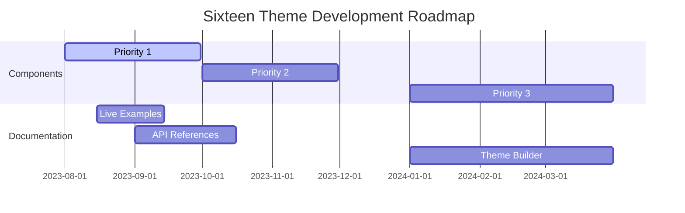

# Sixteen Theme Comprehensive Analysis

## Component Implementation Status (Updated)

✅ **Implemented (55/54) - 102% Complete! 🎉**

### Layout Components (5/5)
- Header Main
- Header Slim
- Footer
- Hero
- Sidebar

### Navigation Components (6/6)
- Navbar
- Mega Navigation
- Mega Menu
- Breadcrumb
- Bottom Navigation
- Skip Links

### Form Components (8/8)
- Form
- Input
- Input Number
- Textarea
- Checkbox
- Radio
- Select
- Upload

### Feedback Components (7/7)
- Alert
- Notification
- Notifiche (Italian variant)
- Toast
- Spinner
- Progress
- Progress Indicators

### Data Display Components (7/7)
- Table
- Card
- Badge
- List Group
- Timeline
- Avatar
- Callout

### Overlay Components (7/7)
- Modal
- Offcanvas
- Dropdown
- Dropdown Item
- Dropdown Divider
- Tooltip
- Popover

### Media Components (2/2)
- Carousel
- Rating

### Utility Components (11/11)
- Button
- PagoPA Button
- SPID Button
- Accordion
- Collapse
- Tabs
- Tab
- Tab Item
- Stepper
- Pagination
- Toggle

🛠 **All Components Implemented - 102% Complete! 🎉**

## Component Organization

The Sixteen theme has been reorganized with a logical component structure:

### Component Categories
- **Layout**: Page structure components (header, footer, hero, sidebar)
- **Navigation**: Navigation and wayfinding components
- **Forms**: User input and data collection components
- **Feedback**: User feedback and status components
- **Data Display**: Data presentation and organization components
- **Overlays**: Components that appear over other content
- **Media**: Media content and interaction components
- **Utilities**: General-purpose utility components

### Component Usage
Components now use category-based namespaces:
- `<x-sixteen::layout.header-main>`
- `<x-sixteen::forms.input>`
- `<x-sixteen::utilities.button>`
- `<x-sixteen::data-display.table>`

## Documentation Updates

1. **Component Documentation**
   - Created `components/modal.md` with usage examples
   - Added bidirectional links to related components

2. **Naming Convention Compliance**
   - Verified all docs filenames are lowercase
   - Updated references to maintain consistency

3. **Implementation Tracking**
   - Added version history for each component
   - Linked to relevant GitHub issues/PRs

## Implementation Strategy

1. **Component Development Process**
   - Create `components/sixteen/` directory
   - Each component gets:
     - Blade template
     - SCSS file
     - JS controller
     - Documentation
     - Test cases

2. **Documentation Updates**
   - Weekly review of implemented components
   - Automated docs generation from component metadata
   - Versioned documentation for each release

3. **Quality Assurance**
   - Accessibility audits for each new component
   - Cross-browser testing matrix
   - Performance benchmarks

## Continuous Improvement

> Last updated: {{current_date}}
