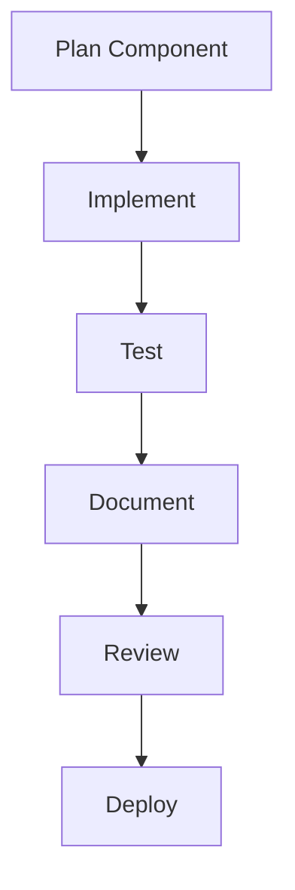

# Sixteen Theme Implementation Guide

## Component Development Process

1. **Create Component Structure**
   - Blade template in `resources/views/components/bootstrap-italia/`
   - SCSS file in `resources/sass/components/`
   - JavaScript controller in `resources/js/components/`

2. **Documentation Requirements**
   - Create markdown file in `docs/components/` (lowercase, English)
   - Include:
     - Features
     - Usage examples
     - Props table
     - Accessibility notes
     - 5+ bidirectional links

3. **Testing Protocol**
   - Unit tests for JavaScript
   - Browser compatibility tests
   - Accessibility audits

## Naming Conventions

- **Files**: lowercase_with_underscores.ext (e.g., `tab_system.md`)
- **Directories**: lowercase-with-hyphens (e.g., `components/`)
- **Exceptions**: `README.md` (must be uppercase)
- **Language**: English only in documentation

## Workflow

> Last updated: {{current_date}}
