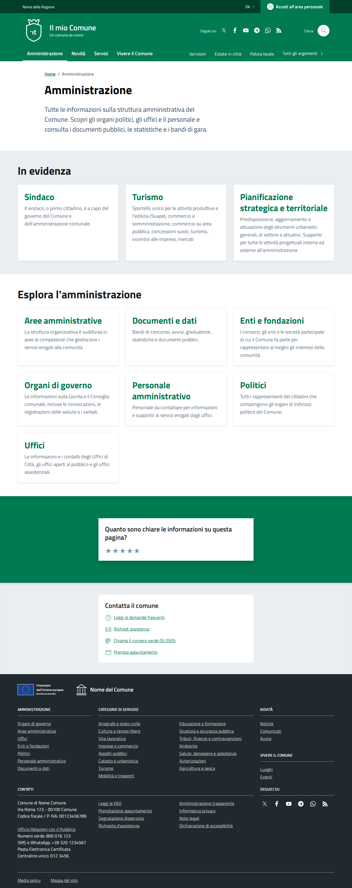

# DIFF Analysis: amministrazione

**Data**: 2026-04-06
**Parity strutturale**: 100%
**Status**: ✅

## URL
- Reference: https://italia.github.io/design-comuni-pagine-statiche/sito/amministrazione.html
- Local: http://127.0.0.1:8000/it/tests/amministrazione

## Metriche HTML
| Metrica | Reference | Local |
|---------|-----------|-------|
| Righe HTML | 970 | 719 |
| Caratteri HTML | 52805 | 44565 |
| Parity strutturale | 100% | 100% |

## Screenshots
- 
- 
- 
- 

## Struttura Reference (tag principali)
```
<header class="it-header-wrapper" data-bs-target="#header-nav-wrapper" style="">
<nav aria-label="Principale">
<nav aria-label="Secondaria">
<main>
<nav class="breadcrumb-container" aria-label="breadcrumb">
<section class="it-hero-wrapper bg-white align-items-start">
<h1 class="text-black" data-element="page-name">
<h2 class="title-xxlarge mb-4">
<h3 class="card-title t-primary">
<h3 class="card-title t-primary">
<h3 class="card-title t-primary">
<h2 class="title-xxlarge mb-4">
<h3 class="card-title t-primary">
<h3 class="card-title t-primary">
<h3 class="card-title t-primary">
<h3 class="card-title t-primary">
<h3 class="card-title t-primary">
<h3 class="card-title t-primary">
<h3 class="card-title t-primary">
<h2 class="title-medium-2-semi-bold mb-0" data-element="feedback-title">
<h2 class="title-medium-2-bold mb-0" id="rating-feedback">
<h3 class="step-title d-flex flex-column flex-lg-row align-items-lg-center justify-content-between drop-shadow">
<h3 class="step-title d-flex flex-column flex-lg-row flex-wrap align-items-lg-center justify-content-between drop-shadow
<h3 class="step-title d-flex flex-column flex-lg-row flex-wrap align-items-lg-center justify-content-between drop-shadow
<h2 class="title-medium-2-semi-bold">
<form>
<h2>
<footer class="it-footer" id="footer">
<h2 class="no_toc">
<h4 class="footer-heading-title">
```

## Struttura Local (tag principali)
```
<header class="it-header-wrapper" data-bs-target="#header-nav-wrapper" style="">
<nav aria-label="Principale">
<nav aria-label="Secondaria">
<main data-page="amministrazione">
<nav class="breadcrumb-container" aria-label="breadcrumb">
<section class="it-hero-wrapper bg-white align-items-start">
<h1 class="text-black" data-element="page-name">
<section class="py-5">
<h2 class="mb-3">
<h5 class="card-title">
<h5 class="card-title">
<h5 class="card-title">
<section class="py-5 bg-it-gray-50">
<h2 class="mb-3">
<h3 class="title-medium-2-semi-bold mb-0">
<form>
<h2>
<footer class="it-footer" id="footer">
<h2 class="no_toc">
<h4 class="footer-heading-title">
<h4 class="footer-heading-title">
<h4 class="footer-heading-title">
<h4 class="footer-heading-title">
<h4 class="footer-heading-title">
<h4 class="footer-heading-title">
```

## Differenze rilevate

### 1. SEZIONE 1 - CARDS IN EVIDENZA (3 card)
| Aspetto | Reference | Local | Priorità |
|---------|-----------|-------|----------|
| Background | `bg-grey-card py-5` (GRIGIO) | `<section class="py-5">` (BIANCO) | CRITICA |
| Card class | `cmp-card-simple card-wrapper pb-0 rounded border border-light` | `card card-teaser shadow p-4 rounded border border-light h-100` | ALTA |
| H3 card | `<h3 class="card-title t-primary">` | `<h5 class="card-title">` (H5 invece di H3!) | ALTA |
| H2 sezione | `<h2 class="title-xxlarge mb-4">` | `<h2 class="mb-3">` (senza `title-xxlarge`) | MEDIA |

### 2. SEZIONE 2 - LISTA LINK (7 elementi)
| Aspetto | Reference | Local | Priorità |
|---------|-----------|-------|----------|
| Background | `container py-5` (BIANCO) | `section py-5 bg-it-gray-50` (GRIGIO) | CRITICA |
| Struttura | `cmp-card-simple card-wrapper` + `card shadow-sm rounded` per ogni elemento | `link-list-wrapper` + `link-list` + `<li>` con link | CRITICA |
| Card/link | Card con `h3.card-title t-primary` + `p.text-secondary mb-0` | Link con `<span>` + `<p class="small text-muted mb-0">` | ALTA |
| H2 sezione | `<h2 class="title-xxlarge mb-4">` | `<h2 class="mb-3">` | MEDIA |

**Nota critica**: I colori di sfondo sono INVERTITI nel local rispetto al reference:
- Reference: sezione 1 GRIGIA, sezione 2 BIANCA
- Local: sezione 1 BIANCA (`py-5`), sezione 2 GRIGIA (`bg-it-gray-50`)

### 3. FEEDBACK SECTION
| Reference | Local | Priorità |
|-----------|-------|----------|
| Sezione rating stelle con `title-medium-2-semi-bold`, step-title, form multi-step | Presente: `it-rating-section` con `it-rating-wrapper` (struttura diversa) | MEDIA |

Note: Il local ha una sezione rating (`it-rating-section`) ma la struttura è diversa da quella del reference (`title-medium-2-semi-bold` + step-title).

### 4. RIEPILOGO PRIORITÀ
- 🔴 **CRITICA**: Sfondo sezioni invertito (grigio/bianco scambiati)
- 🔴 **CRITICA**: Struttura sezione 2 usa `link-list` invece di `cmp-card-simple` card grid
- 🟠 **ALTA**: H5 invece di H3 per card titles, card class diversa
- 🟡 **MEDIA**: `title-xxlarge` mancante su H2, struttura feedback diversa
- 🟢 **BASSA**: Classi minori su container

## Link
- [Indice pagine](../PAGES-INDEX.md)
- [Design Comuni docs](../../design-comuni/00-index.md)
