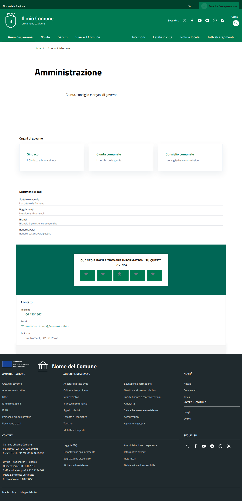
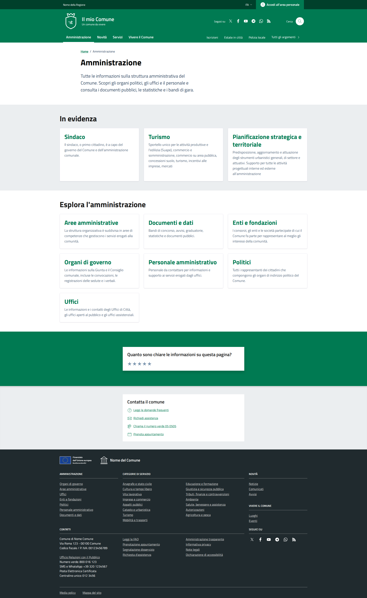
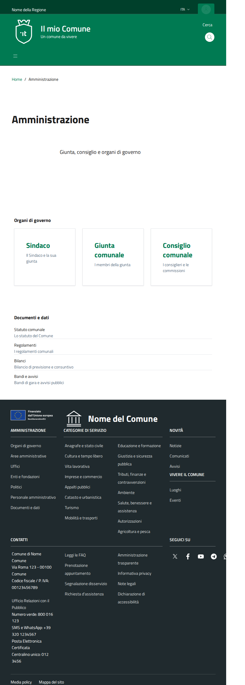
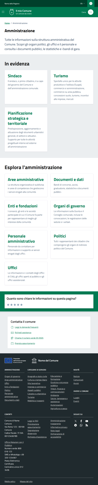
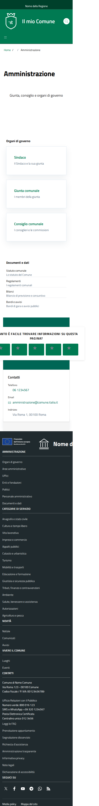
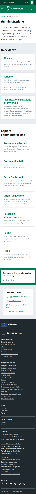

# amministrazione - Detailed Visual Comparison

**Analysis Date**: 2026-04-04T19:50:43.051Z

## Desktop (1920px)

### Local

### Reference

## Tablet (768px)

### Local

### Reference

## Mobile (375px)

### Local

### Reference

## Known Issues to Fix

1. **Map Layout (PRIORITY)**
   - Issue: Map goes to new line instead of staying beside filter
   - Location: Desktop view
   - Fix: Adjust flexbox/grid for filter + map container

2. **Spacing & Padding**
   - Check section margins
   - Verify gap between elements

3. **Typography**
   - Font sizes may differ
   - Line heights to verify

## Action Items

- [ ] Fix map layout (flexbox/grid)
- [ ] Verify all section spacing
- [ ] Check form styling
- [ ] Test responsive breakpoints
- [ ] Compare colors and backgrounds
