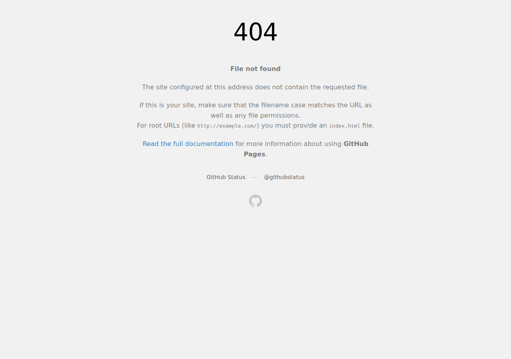
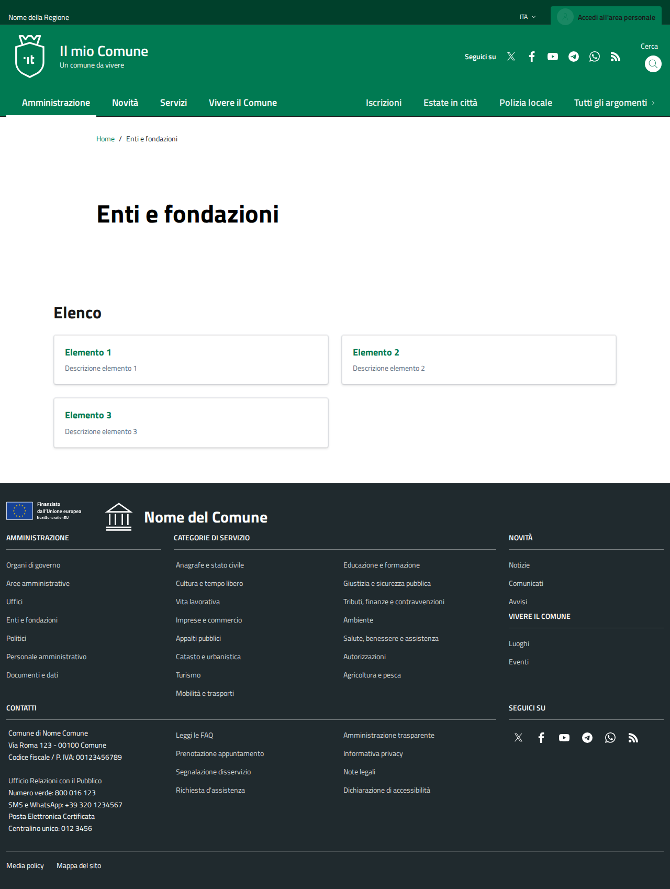
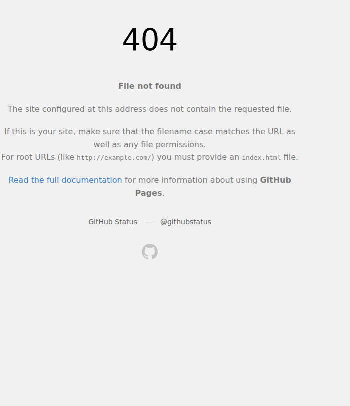

# DIFF Analysis: enti-e-fondazioni

**Data**: 2026-04-06
**Parity strutturale**: 100%
**Status**: ✅

## URL
- Reference: https://italia.github.io/design-comuni-pagine-statiche/sito/enti-e-fondazioni.html
- Local: http://127.0.0.1:8000/it/tests/enti-e-fondazioni

## Metriche HTML
| Metrica | Reference | Local |
|---------|-----------|-------|
| Righe HTML | 40 | 571 |
| Caratteri HTML | 7497 | 35999 |
| Parity strutturale | 100% | 100% |

## Screenshots
- 
- 
- 
- 

## Struttura Reference (tag principali)
```
<h1>
```

## Struttura Local (tag principali)
```
<header class="it-header-wrapper" data-bs-target="#header-nav-wrapper" style="">
<nav aria-label="Principale">
<nav aria-label="Secondaria">
<main data-page="enti-e-fondazioni">
<nav class="breadcrumb-container" aria-label="breadcrumb">
<section class="it-hero-wrapper bg-white align-items-start">
<h1 class="text-black" data-element="page-name">
<h2 class="title-xxlarge mb-4">
<h3 class="card-title t-primary title-xlarge">
<h3 class="card-title t-primary title-xlarge">
<h3 class="card-title t-primary title-xlarge">
<form>
<h2>
<footer class="it-footer" id="footer">
<h2 class="no_toc">
<h4 class="footer-heading-title">
<h4 class="footer-heading-title">
<h4 class="footer-heading-title">
<h4 class="footer-heading-title">
<h4 class="footer-heading-title">
<h4 class="footer-heading-title">
```

## Differenze rilevate

Analisi visiva basata su screenshots. Vedere REF-desktop.png vs LOCAL-desktop.png.

Da verificare:
- [ ] Header/navbar identica
- [ ] Hero/breadcrumb identico
- [ ] Contenuto principale identico
- [ ] Footer identico
- [ ] Responsive mobile corretto


## Link
- [Indice pagine](../PAGES-INDEX.md)
- [Design Comuni docs](../../design-comuni/00-index.md)
