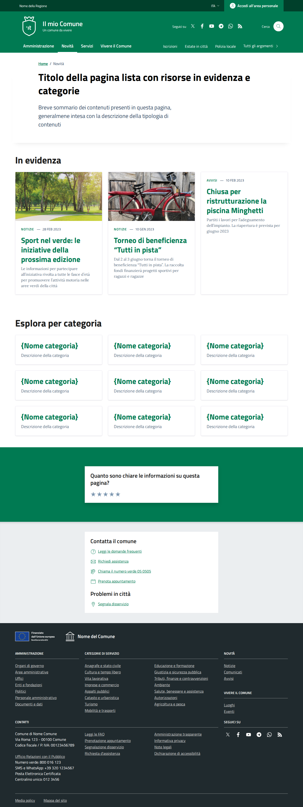
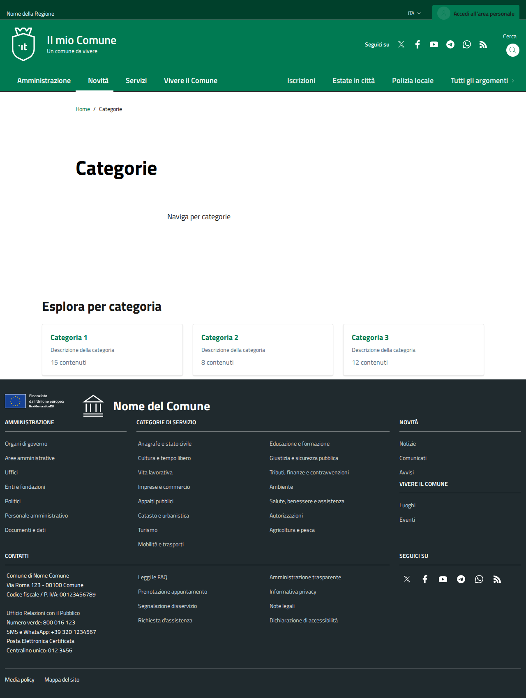
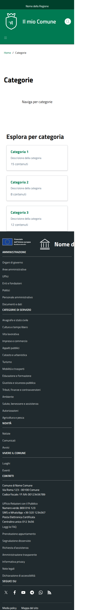

# DIFF Analysis: lista-categorie

**Data**: 2026-04-06
**Parity strutturale**: 100%
**Status**: ✅

## URL
- Reference: https://italia.github.io/design-comuni-pagine-statiche/sito/lista-categorie.html
- Local: http://127.0.0.1:8000/it/tests/lista-categorie

## Metriche HTML
| Metrica | Reference | Local |
|---------|-----------|-------|
| Righe HTML | 1021 | 583 |
| Caratteri HTML | 55513 | 37136 |
| Parity strutturale | 100% | 100% |

## Screenshots
- 
- 
- 
- 

## Struttura Reference (tag principali)
```
<header class="it-header-wrapper" data-bs-target="#header-nav-wrapper" style="">
<nav aria-label="Principale">
<nav aria-label="Secondaria">
<main>
<nav class="breadcrumb-container" aria-label="breadcrumb">
<section class="it-hero-wrapper bg-white align-items-start">
<h1 class="text-black" data-element="page-name">
<h2 class="title-xxlarge mb-4">
<h3 class="card-title">
<h3 class="card-title">
<h3 class="card-title">
<h2 class="title-xxlarge mb-4">
<h3 class="card-title t-primary title-xlarge">
<h3 class="card-title t-primary title-xlarge">
<h3 class="card-title t-primary title-xlarge">
<h3 class="card-title t-primary title-xlarge">
<h3 class="card-title t-primary title-xlarge">
<h3 class="card-title t-primary title-xlarge">
<h3 class="card-title t-primary title-xlarge">
<h3 class="card-title t-primary title-xlarge">
<h3 class="card-title t-primary title-xlarge">
<h2 class="title-medium-2-semi-bold mb-0" data-element="feedback-title">
<h2 class="title-medium-2-bold mb-0" id="rating-feedback">
<h3 class="step-title d-flex flex-column flex-lg-row align-items-lg-center justify-content-between drop-shadow">
<h3 class="step-title d-flex flex-column flex-lg-row flex-wrap align-items-lg-center justify-content-between drop-shadow
<h3 class="step-title d-flex flex-column flex-lg-row flex-wrap align-items-lg-center justify-content-between drop-shadow
<h2 class="title-medium-2-semi-bold">
<h2 class="title-medium-2-semi-bold mt-4">
<form>
<h2>
```

## Struttura Local (tag principali)
```
<header class="it-header-wrapper" data-bs-target="#header-nav-wrapper" style="">
<nav aria-label="Principale">
<nav aria-label="Secondaria">
<main data-page="lista-categorie">
<nav class="breadcrumb-container" aria-label="breadcrumb">
<section class="it-hero-wrapper bg-white align-items-start">
<h1 class="text-black" data-element="page-name">
<h2 class="title-xxlarge mb-4">
<h3 class="card-title t-primary title-xlarge">
<h3 class="card-title t-primary title-xlarge">
<h3 class="card-title t-primary title-xlarge">
<form>
<h2>
<footer class="it-footer" id="footer">
<h2 class="no_toc">
<h4 class="footer-heading-title">
<h4 class="footer-heading-title">
<h4 class="footer-heading-title">
<h4 class="footer-heading-title">
<h4 class="footer-heading-title">
<h4 class="footer-heading-title">
```

## Differenze rilevate

### 1. HERO/HEADING
| Aspetto | Reference | Local | Priorità |
|---------|-----------|-------|----------|
| Row class | `row justify-content-center row-shadow` | `row justify-content-center` (manca `row-shadow`) | ALTA |
| Componente hero | `it-hero-wrapper bg-white align-items-start` + `it-hero-text-wrapper pt-0 ps-0 pb-4 pb-lg-60` | Stesso | OK |

### 2. SEZIONE 1 - CARDS IN EVIDENZA (primi 3 elementi, con immagini)
| Aspetto | Reference | Local | Priorità |
|---------|-----------|-------|----------|
| Struttura card | `card-wrapper border border-light rounded shadow-sm` + `card no-after rounded` + `img-responsive-wrapper` + `img-responsive img-responsive-panoramic` + `figure.img-wrapper` | `cmp-card-simple card-wrapper pb-0 rounded border border-light` + `card shadow-sm rounded` (SOLO testo, niente immagine) | CRITICA |
| Categoria link | `<a class="category text-decoration-none">` | `<a class="text-decoration-none">` (senza classe `category`) | MEDIA |

**Nota importante**: Il reference usa card con immagini per la prima sezione, ma il local usa `cmp-card-simple` che non prevede immagini. Le card visualmente sembreranno diverse.

### 3. SEZIONE 2 - CATEGORIE/ARGOMENTI
| Aspetto | Reference | Local | Priorità |
|---------|-----------|-------|----------|
| ID sezione | `<div class="container py-5" id="argomento">` | Assente l'`id="argomento"` | MEDIA |
| Card class | `cmp-card-simple card-wrapper pb-0 rounded border border-light` | Stesso | OK |
| Card body | `<h3 class="card-title t-primary title-xlarge">` + `<p class="text-secondary mb-0 description">` | Stesso + `<p class="text-muted mb-0 mt-2 small">` extra | BASSA |

**Nota**: Il local aggiunge un paragrafo extra con il conteggio degli elementi per categoria.

### 4. PAGINAZIONE
| Reference | Local | Priorità |
|-----------|-------|----------|
| `nav.pagination-wrapper` con pagine numerate | Assente | ALTA |

### 5. FEEDBACK SECTION
| Reference | Local | Priorità |
|-----------|-------|----------|
| Sezione rating stelle completa | Assente | MEDIA |

### 6. SEZIONE RICERCA
| Reference | Local | Priorità |
|-----------|-------|----------|
| `cmp-input-search` con autocomplete | Solo form di ricerca base | ALTA |

### 7. RIEPILOGO PRIORITÀ
- 🔴 **CRITICA**: Card struttura sezione 1 (`img-responsive-wrapper` mancante - no immagini visibili)
- 🟠 **ALTA**: `row-shadow` mancante hero, paginazione assente, autocomplete search
- 🟡 **MEDIA**: `id="argomento"` mancante, classe `category` sul link, feedback assente
- 🟢 **BASSA**: Paragrafo conteggio extra nel local, breakpoints minori

## Link
- [Indice pagine](../PAGES-INDEX.md)
- [Design Comuni docs](../../design-comuni/00-index.md)
