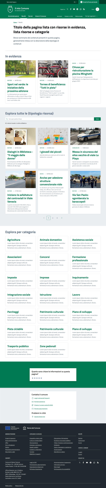
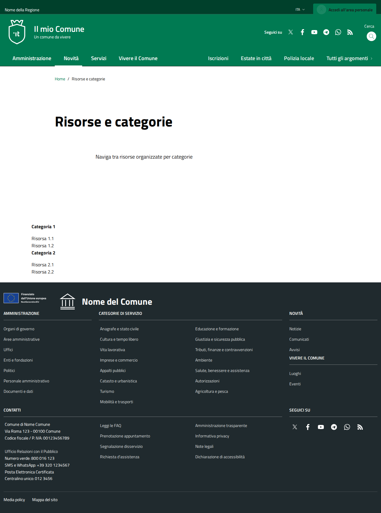
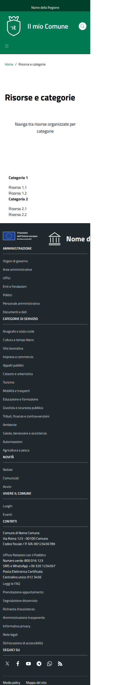

# DIFF Analysis: lista-risorse-categorie

**Data**: 2026-04-06
**Parity strutturale**: 100%
**Status**: ✅

## URL
- Reference: https://italia.github.io/design-comuni-pagine-statiche/sito/lista-risorse-categorie.html
- Local: http://127.0.0.1:8000/it/tests/lista-risorse-categorie

## Metriche HTML
| Metrica | Reference | Local |
|---------|-----------|-------|
| Righe HTML | 1372 | 555 |
| Caratteri HTML | 73371 | 35828 |
| Parity strutturale | 100% | 100% |

## Screenshots
- 
- 
- 
- 

## Struttura Reference (tag principali)
```
<header class="it-header-wrapper" data-bs-target="#header-nav-wrapper" style="">
<nav aria-label="Principale">
<nav aria-label="Secondaria">
<main>
<nav class="breadcrumb-container" aria-label="breadcrumb">
<section class="it-hero-wrapper bg-white align-items-start">
<h1 class="text-black" data-element="page-name">
<h2 class="text-secondary mb-4">
<h3 class="card-title">
<h3 class="card-title">
<h3 class="card-title">
<h2 class="text-secondary mb-4">
<h3 class="card-title">
<h3 class="card-title">
<h3 class="card-title">
<h3 class="card-title">
<h3 class="card-title">
<h3 class="card-title">
<nav class="pagination-wrapper justify-content-center" aria-label="Navigazione centrata">
<h2 class="text-secondary mb-4">
<h3 class="card-title t-primary title-xlarge">
<h3 class="card-title t-primary title-xlarge">
<h3 class="card-title t-primary title-xlarge">
<h3 class="card-title t-primary title-xlarge">
<h3 class="card-title t-primary title-xlarge">
<h3 class="card-title t-primary title-xlarge">
<h3 class="card-title t-primary title-xlarge">
<h3 class="card-title t-primary title-xlarge">
<h3 class="card-title t-primary title-xlarge">
<h3 class="card-title t-primary title-xlarge">
```

## Struttura Local (tag principali)
```
<header class="it-header-wrapper" data-bs-target="#header-nav-wrapper" style="">
<nav aria-label="Principale">
<nav aria-label="Secondaria">
<main data-page="lista-risorse-categorie">
<nav class="breadcrumb-container" aria-label="breadcrumb">
<section class="it-hero-wrapper bg-white align-items-start">
<h1 class="text-black" data-element="page-name">
<section class="section py-4">
<h3 class="h4 mb-3">
<h3 class="h4 mb-3">
<form>
<h2>
<footer class="it-footer" id="footer">
<h2 class="no_toc">
<h4 class="footer-heading-title">
<h4 class="footer-heading-title">
<h4 class="footer-heading-title">
<h4 class="footer-heading-title">
<h4 class="footer-heading-title">
<h4 class="footer-heading-title">
```

## Differenze rilevate

### 1. STRUTTURA PRINCIPALE - Differenze CRITICHE
La pagina reference ha una struttura completamente diversa dal local.

**REFERENCE**: Due sezioni distinte di card (con immagini + ricerca) + sezione categorie laterale
- Sezione 1 bianca: `<div class="container py-5">` con H2 `class="text-secondary mb-4"` + card con `img-responsive-wrapper` (3 col)
- Sezione 2 grigia: `<div class="bg-grey-card py-5">` con autocomplete + lista card (3 col) + paginazione
- Sezione 3: categorie con `cmp-card-simple` (stesso `text-secondary mb-4`)

**LOCAL**: Layout completamente diverso
- `<section class="section py-4">` con gruppi `list-group` 
- Usa `list-group-item list-group-item-action d-flex justify-content-between align-items-center` (stile elenco, non card)
- Niente sezione grigia separata
- Niente immagini nelle card

### 2. CONFRONTO DETTAGLIATO
| Aspetto | Reference | Local | Priorità |
|---------|-----------|-------|----------|
| H2 sezione | `class="text-secondary mb-4"` | assente (usa H3) | ALTA |
| Card type sezione 1 | `card-wrapper` + `card no-after` + `img-responsive-wrapper` | `list-group-item` (formato lista) | CRITICA |
| Background sezione 2 | `bg-grey-card py-5` | Assente | CRITICA |
| Autocomplete search | `cmp-input-search` con autocomplete widget | Assente | ALTA |
| Paginazione | `pagination-wrapper` con pagine numerate | Assente | ALTA |
| Sezione categorie | `cmp-card-simple` con `text-secondary` | Assente | ALTA |
| Feedback | Sezione rating completa | Assente | MEDIA |

### 3. LAYOUT RADICALMENTE DIVERSO
Il local usa `list-group` (formato Bootstrap elenco) invece di card grid come nel reference.
Il reference mostra risorse come card con immagini in griglia 3 colonne.
Il local mostra risorse come lista con badge contatori.

### 4. RIEPILOGO PRIORITÀ
- 🔴 **CRITICA**: Layout completamente diverso - lista vs card grid, niente `img-responsive-wrapper`
- 🔴 **CRITICA**: Sezione grigia `bg-grey-card` con autocomplete completamente assente
- 🟠 **ALTA**: Paginazione assente, H2 con `text-secondary`, categorie assenti
- 🟡 **MEDIA**: Feedback assente
- ℹ️ **NOTA**: Questa pagina richiede una riscrittura sostanziale del blade/JSON

## Link
- [Indice pagine](../PAGES-INDEX.md)
- [Design Comuni docs](../../design-comuni/00-index.md)
