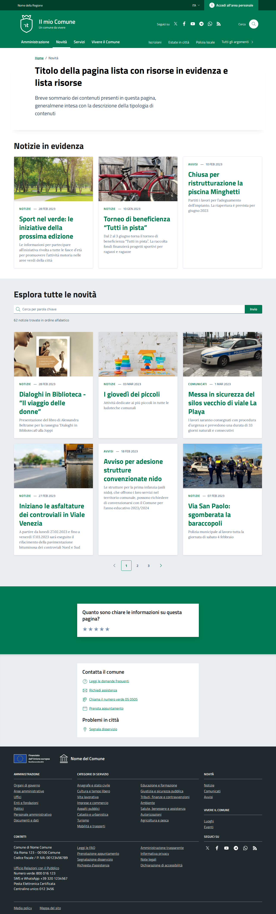
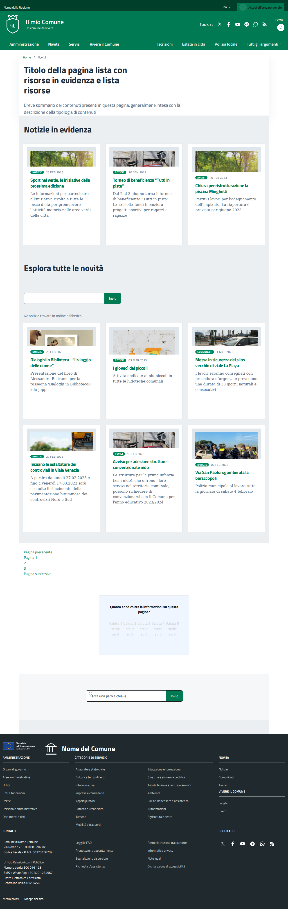
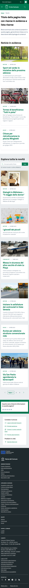

# DIFF Analysis: lista-risorse

**Data**: 2026-04-06
**Parity strutturale**: 100%
**Status**: ✅

## URL
- Reference: https://italia.github.io/design-comuni-pagine-statiche/sito/lista-risorse.html
- Local: http://127.0.0.1:8000/it/tests/lista-risorse

## Metriche HTML
| Metrica | Reference | Local |
|---------|-----------|-------|
| Righe HTML | 1086 | 922 |
| Caratteri HTML | 59792 | 61373 |
| Parity strutturale | 100% | 100% |

## Screenshots
- 
- 
- 
- 

## Struttura Reference (tag principali)
```
<header class="it-header-wrapper" data-bs-target="#header-nav-wrapper" style="">
<nav aria-label="Principale">
<nav aria-label="Secondaria">
<main>
<nav class="breadcrumb-container" aria-label="breadcrumb">
<section class="it-hero-wrapper bg-white align-items-start">
<h1 class="text-black" data-element="page-name">
<h2 class="title-xxlarge mb-4">
<h3 class="card-title">
<h3 class="card-title">
<h3 class="card-title">
<h2 class="title-xxlarge mb-4">
<h3 class="card-title">
<h3 class="card-title">
<h3 class="card-title">
<h3 class="card-title">
<h3 class="card-title">
<h3 class="card-title">
<nav class="pagination-wrapper justify-content-center" aria-label="Navigazione centrata">
<h2 class="title-medium-2-semi-bold mb-0" data-element="feedback-title">
<h2 class="title-medium-2-bold mb-0" id="rating-feedback">
<h3 class="step-title d-flex flex-column flex-lg-row align-items-lg-center justify-content-between drop-shadow">
<h3 class="step-title d-flex flex-column flex-lg-row flex-wrap align-items-lg-center justify-content-between drop-shadow
<h3 class="step-title d-flex flex-column flex-lg-row flex-wrap align-items-lg-center justify-content-between drop-shadow
<h2 class="title-medium-2-semi-bold">
<h2 class="title-medium-2-semi-bold mt-4">
<form>
<h2>
<footer class="it-footer" id="footer">
<h2 class="no_toc">
```

## Struttura Local (tag principali)
```
<header class="it-header-wrapper" data-bs-target="#header-nav-wrapper" style="">
<nav aria-label="Principale">
<nav aria-label="Secondaria">
<main data-page="lista-risorse">
<nav class="cmp-breadcrumbs mt-4" aria-label="Breadcrumb">
<h1>
<section class="section section-muted">
<h2>
<article class="card card-teaser card-teaser-image-top no-after rounded shadow-sm h-100">
<h3 class="card-title h5">
<article class="card card-teaser card-teaser-image-top no-after rounded shadow-sm h-100">
<h3 class="card-title h5">
<article class="card card-teaser card-teaser-image-top no-after rounded shadow-sm h-100">
<h3 class="card-title h5">
<section class="section">
<h2>
<form class="cmp-input-search mb-4" role="search">
<article class="card card-teaser card-teaser-image-top no-after rounded shadow-sm h-100">
<h3 class="card-title h5">
<article class="card card-teaser card-teaser-image-top no-after rounded shadow-sm h-100">
<h3 class="card-title h5">
<article class="card card-teaser card-teaser-image-top no-after rounded shadow-sm h-100">
<h3 class="card-title h5">
<article class="card card-teaser card-teaser-image-top no-after rounded shadow-sm h-100">
<h3 class="card-title h5">
<article class="card card-teaser card-teaser-image-top no-after rounded shadow-sm h-100">
<h3 class="card-title h5">
<article class="card card-teaser card-teaser-image-top no-after rounded shadow-sm h-100">
<h3 class="card-title h5">
<nav class="cmp-pagination" aria-label="Paginazione">
```

## Differenze rilevate

### 1. BREADCRUMB - Differenze strutturali
| Aspetto | Reference | Local | Priorità |
|---------|-----------|-------|----------|
| Contenitore | `<div class="cmp-breadcrumbs"><nav class="breadcrumb-container">` | `<nav class="cmp-breadcrumbs mt-4">` | MEDIA |
| Separatore | `<span class="separator">` presente | Assente | MEDIA |
| Classe OL | `<ol class="breadcrumb p-0">` | `<ol class="breadcrumb">` | BASSA |

### 2. HERO/HEADING - Differenze CRITICHE
| Aspetto | Reference | Local | Priorità |
|---------|-----------|-------|----------|
| Colonna | `col-12 col-lg-10` | `col-12 col-lg-8` | ALTA |
| Row class | `row-shadow` presente | `row` senza `row-shadow` | ALTA |
| Componente | `<div class="cmp-hero"><section class="it-hero-wrapper bg-white align-items-start">` | `<div class="cmp-heading pb-3 pb-lg-4">` | CRITICA |
| H1 class | `class="text-black"` | nessuna classe | BASSA |
| Testo intro | dentro `<div class="hero-text"><p>` | `<p class="lead">` | MEDIA |

### 3. CARDS IN EVIDENZA (sezione 1) - Differenze CRITICHE
| Aspetto | Reference | Local | Priorità |
|---------|-----------|-------|----------|
| Background sezione | bianco `container py-5` | grigio `section section-muted` | CRITICA |
| Struttura card | `card-wrapper border border-light rounded shadow-sm` + `card no-after rounded` + `img-responsive-wrapper` + `img-responsive img-responsive-panoramic` + `figure.img-wrapper` | `article.card card-teaser card-teaser-image-top no-after rounded shadow-sm h-100` + `card-image-wrapper with-read-more` | CRITICA |
| Categoria | `<a class="category text-decoration-none">` | `<span class="badge bg-primary">` | CRITICA |
| Colonne | `col-md-6 col-xl-4` (3 colonne su XL) | `col-12 col-md-6 col-lg-4` (3 colonne su LG) | BASSA |

### 4. SEZIONE RICERCA + LISTA (sezione 2) - Differenze CRITICHE
| Aspetto | Reference | Local | Priorità |
|---------|-----------|-------|----------|
| Background | grigio `bg-grey-card py-5` | bianco `section` | CRITICA (colori invertiti!) |
| Autocomplete search | `form-group autocomplete-wrapper` + input `class="autocomplete form-control"` con `id` specifico | `form.cmp-input-search` + `input.form-control` semplice | ALTA |
| Colonne lista | `col-md-6 col-xl-4` (3 colonne) | `col-12 col-lg-6` (2 colonne) | CRITICA |

### 5. PAGINAZIONE
| Reference | Local | Priorità |
|-----------|-------|----------|
| `nav.pagination-wrapper` con `ul.pagination` e pagine numerate | `nav.cmp-pagination` presente ma struttura diversa | ALTA |

### 6. FEEDBACK SECTION
| Reference | Local | Priorità |
|-----------|-------|----------|
| Sezione rating stelle + form multi-step completo (`title-medium-2-semi-bold`, step-title, ecc.) | Assente | MEDIA |

### 7. RIEPILOGO PRIORITÀ
- 🔴 **CRITICA**: Card structure (`card-wrapper` vs `card-teaser`), colori background invertiti (grigio/bianco scambiati), componente hero mancante
- 🟠 **ALTA**: Autocomplete search component, paginazione diversa, colonne lista (3 vs 2)
- 🟡 **MEDIA**: Breadcrumb structure, row-shadow mancante, feedback section
- 🟢 **BASSA**: H1 class, separatore breadcrumb, breakpoint colonne minori

## Link
- [Indice pagine](../PAGES-INDEX.md)
- [Design Comuni docs](../../design-comuni/00-index.md)
