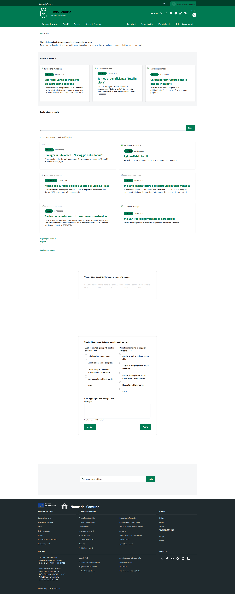
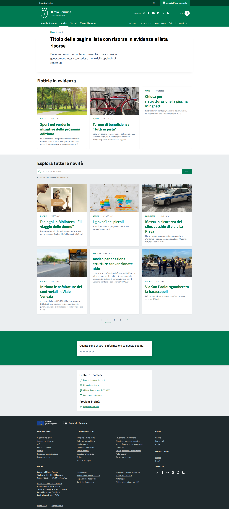
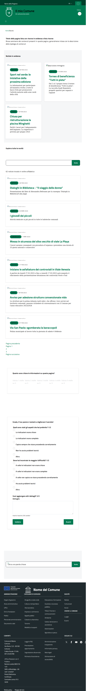
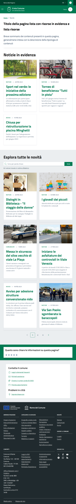

# Visual Comparison: lista-risorse

**Page URLs:**
- Local: http://127.0.0.1:8000/it/tests/lista-risorse
- Reference: https://italia.github.io/design-comuni-pagine-statiche/sito/lista-risorse.html

## Desktop (1920x1080)

### Local

### Reference

## Tablet (768x1024)

### Local

### Reference

## Key Differences

1. **Height Difference**: +490px (local page taller)
2. **Extra Elements**: +59 total (mostly DIVs and paragraphs)
3. **Extra Buttons**: +5 buttons
4. **Extra Content**: More padding/spacing in local version

## CSS Fixes Needed

1. Reduce vertical padding on containers
2. Adjust margin between sections
3. Review paragraph spacing
4. Check for extra hidden divs
