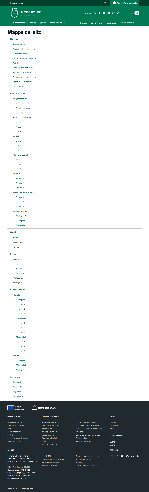

# DIFF Analysis: mappa-sito

**Data**: 2026-04-06
**Parity strutturale**: 100%
**Status**: ✅

## URL
- Reference: https://italia.github.io/design-comuni-pagine-statiche/sito/mappa-sito.html
- Local: http://127.0.0.1:8000/it/tests/mappa-sito

## Metriche HTML
| Metrica | Reference | Local |
|---------|-----------|-------|
| Righe HTML | 760 | 706 |
| Caratteri HTML | 39880 | 41971 |
| Parity strutturale | 100% | 100% |

## Screenshots
- 
- 
- 
- 

## Struttura Reference (tag principali)
```
<header class="it-header-wrapper" data-bs-target="#header-nav-wrapper" style="">
<nav aria-label="Principale">
<nav aria-label="Secondaria">
<main>
<h1>
<form>
<h2>
<footer class="it-footer" id="footer">
<h2 class="no_toc">
<h4 class="footer-heading-title">
<h4 class="footer-heading-title">
<h4 class="footer-heading-title">
<h4 class="footer-heading-title">
<h4 class="footer-heading-title">
<h4 class="footer-heading-title">
```

## Struttura Local (tag principali)
```
<header class="it-header-wrapper" data-bs-target="#header-nav-wrapper" style="">
<nav aria-label="Principale">
<nav aria-label="Secondaria">
<main data-page="mappa-sito">
<nav class="breadcrumb-container" aria-label="breadcrumb">
<section class="it-hero-wrapper bg-white align-items-start">
<h1 class="text-black" data-element="page-name">
<section class="cmp-links-grid mb-8">
<h2 class="title-xlarge mb-4">
<h3 class="card-title h5">
<h3 class="card-title h5">
<h3 class="card-title h5">
<h3 class="card-title h5">
<h3 class="card-title h5">
<h3 class="card-title h5">
<section class="cmp-links-grid mb-8">
<h2 class="title-xlarge mb-4">
<h3 class="card-title h5">
<h3 class="card-title h5">
<h3 class="card-title h5">
<section class="cmp-links-grid mb-8">
<h2 class="title-xlarge mb-4">
<h3 class="card-title h5">
<h3 class="card-title h5">
<h3 class="card-title h5">
<form>
<h2>
<footer class="it-footer" id="footer">
<h2 class="no_toc">
<h4 class="footer-heading-title">
```

## Differenze rilevate

### 1. STRUTTURA PRINCIPALE - Differenze CRITICHE
La pagina reference ha una struttura radicalmente diversa.

**REFERENCE** (`<main>`):
- `<div class="container my-4">` → `<div class="row">` → `<div class="col-12">`
- `<h1>` semplice (NO hero, NO breadcrumb)
- `<div class="link-list-wrapper">` + `<ul class="link-list">` con struttura annidata:
  - `<li>` con `<a class="list-item large medium">` + `<span class="list-item-title">`
  - `<ul class="link-sublist">` con `<li>` e `<a class="list-item">`
  - Divisori con `<li class="divider">`
  - Sotto-liste con `<span class="fw-semibold">`

**LOCAL** (`<main>`):
- Breadcrumb + Hero (`it-hero-wrapper`) presenti (NON nel reference)
- Usa `<section class="cmp-links-grid mb-8">` con grid card (`card card-bg`)
- Card con `<h3 class="card-title h5">` + `<a class="text-decoration-none">` + `<p class="card-text text-muted">`
- Struttura visiva completamente diversa: card grid vs lista gerarchica

### 2. CONFRONTO DETTAGLIATO
| Aspetto | Reference | Local | Priorità |
|---------|-----------|-------|----------|
| Struttura navigazione | `link-list-wrapper` + `link-list` + `link-sublist` gerarchica | `cmp-links-grid` con card grid | CRITICA |
| Hero/Breadcrumb | ASSENTE nel reference | PRESENTE nel local | CRITICA |
| Contenitore main | `container my-4` semplice | `container id="main-container"` con hero | ALTA |
| Visualizzazione | Lista gerarchica testuale annidata | Card grid con immagini/box | CRITICA |
| Divisori sezione | `<li class="divider">` | Sezioni separate `cmp-links-grid` | DIVERSO |
| Profondità | Fino a 3 livelli di annidamento | Solo 1 livello (H2 + card) | CRITICA |

### 3. IMPATTO VISIVO
Il reference mostra la mappa del sito come un elenco gerarchico testuale (stile documento) con link annidati.
Il local mostra la mappa del sito come una griglia di card visive per categoria.
Queste sono scelte di design fondamentalmente diverse. Il local non corrisponde al reference.

### 4. RIEPILOGO PRIORITÀ
- 🔴 **CRITICA**: Struttura completamente diversa (link-list gerarchica vs card grid)
- 🔴 **CRITICA**: Local ha hero+breadcrumb che non esistono nel reference
- 🟠 **ALTA**: Profondità di navigazione - reference ha 3 livelli, local ha 1
- ℹ️ **NOTA**: Questa pagina richiede riscrittura completa per usare `link-list-wrapper`

## Link
- [Indice pagine](../PAGES-INDEX.md)
- [Design Comuni docs](../../design-comuni/00-index.md)
