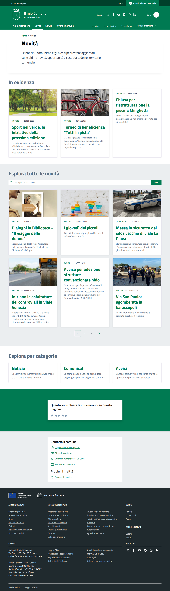
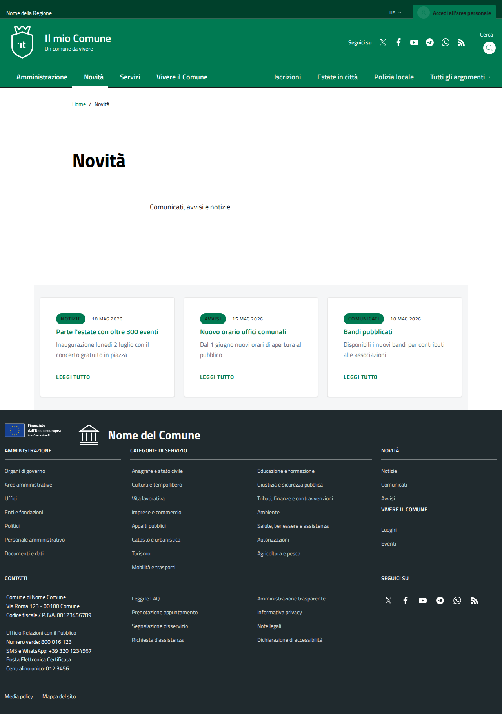
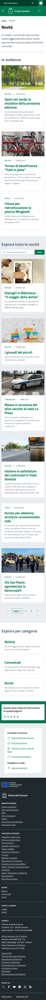
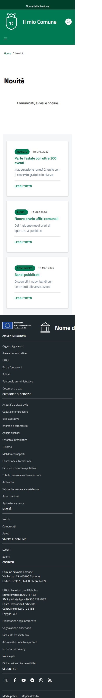

# DIFF Analysis: novita

**Data**: 2026-04-06
**Parity strutturale**: 100%
**Status**: ✅

## URL
- Reference: https://italia.github.io/design-comuni-pagine-statiche/sito/novita.html
- Local: http://127.0.0.1:8000/it/tests/novita

## Metriche HTML
| Metrica | Reference | Local |
|---------|-----------|-------|
| Righe HTML | 1132 | 595 |
| Caratteri HTML | 62789 | 38656 |
| Parity strutturale | 100% | 100% |

## Screenshots
- 
- 
- 
- 

## Struttura Reference (tag principali)
```
<header class="it-header-wrapper" data-bs-target="#header-nav-wrapper" style="">
<nav aria-label="Principale">
<nav aria-label="Secondaria">
<main>
<nav class="breadcrumb-container" aria-label="breadcrumb">
<section class="it-hero-wrapper bg-white align-items-start">
<h1 class="text-black" data-element="page-name">
<h2 class="text-secondary mb-4">
<h3 class="card-title">
<h3 class="card-title">
<h3 class="card-title">
<h2 class="text-secondary mb-4">
<h3 class="card-title">
<h3 class="card-title">
<h3 class="card-title">
<h3 class="card-title">
<h3 class="card-title">
<h3 class="card-title">
<nav class="pagination-wrapper justify-content-center" aria-label="Navigazione centrata">
<h2 class="text-secondary mb-4">
<h3 class="card-title t-primary title-xlarge">
<h3 class="card-title t-primary title-xlarge">
<h3 class="card-title t-primary title-xlarge">
<h2 class="title-medium-2-semi-bold mb-0" data-element="feedback-title">
<h2 class="title-medium-2-bold mb-0" id="rating-feedback">
<h3 class="step-title d-flex flex-column flex-lg-row align-items-lg-center justify-content-between drop-shadow">
<h3 class="step-title d-flex flex-column flex-lg-row flex-wrap align-items-lg-center justify-content-between drop-shadow
<h3 class="step-title d-flex flex-column flex-lg-row flex-wrap align-items-lg-center justify-content-between drop-shadow
<h2 class="title-medium-2-semi-bold">
<h2 class="title-medium-2-semi-bold mt-4">
```

## Struttura Local (tag principali)
```
<header class="it-header-wrapper" data-bs-target="#header-nav-wrapper" style="">
<nav aria-label="Principale">
<nav aria-label="Secondaria">
<main data-page="novita">
<nav class="breadcrumb-container" aria-label="breadcrumb">
<section class="it-hero-wrapper bg-white align-items-start">
<h1 class="text-black" data-element="page-name">
<section class="section section-muted pt-4 pb-5">
<article class="card card-teaser card-teaser-image-top shadow-sm rounded h-100">
<h3 class="card-title h5 mb-2">
<article class="card card-teaser card-teaser-image-top shadow-sm rounded h-100">
<h3 class="card-title h5 mb-2">
<article class="card card-teaser card-teaser-image-top shadow-sm rounded h-100">
<h3 class="card-title h5 mb-2">
<form>
<h2>
<footer class="it-footer" id="footer">
<h2 class="no_toc">
<h4 class="footer-heading-title">
<h4 class="footer-heading-title">
<h4 class="footer-heading-title">
<h4 class="footer-heading-title">
<h4 class="footer-heading-title">
<h4 class="footer-heading-title">
```

## Differenze rilevate — GROUP-B Analysis (2026-04-06)

### Visual Parity: ~40%

### Priority 1 — Critical Missing Content

#### 1.1 "In evidenza" section with featured images
- **REF**: 3 cards with large images, category badge (NOTIZIE/AVVISI/COMUNICATI), date, title, excerpt — displayed in a prominent top section
- **LOCAL**: Absent; only shows the 3 news cards without featured treatment, no images

#### 1.2 Search bar ("Esplora tutte le novità")
- **REF**: `cmp-input-search` search field with button for filtering news
- **LOCAL**: No search bar

#### 1.3 Pagination controls
- **REF**: `pagination-wrapper` with "Precedente / 1 2 3 / Successiva" controls
- **LOCAL**: No pagination

#### 1.4 Category exploration ("Esplora per categoria")
- **REF**: 3 category cards (`cmp-card-simple`) for Notizie / Comunicati / Avvisi with descriptions
- **LOCAL**: Not present

#### 1.5 Feedback/rating section
- **REF**: `cmp-rating` with star rating + multi-step form
- **LOCAL**: Absent

#### 1.6 Contact section
- **REF**: `cmp-contacts` + "Problemi in città" + "Forse stavi cercando"
- **LOCAL**: Absent

### Priority 2 — Structural Differences

#### 2.1 News card style
- **REF**: `card-wrapper border border-light rounded shadow-sm` with image at top, category badge, date, title
- **LOCAL**: `card card-teaser shadow-sm rounded h-100` — different class structure, no images, no category badges; cards are displayed in a muted section

#### 2.2 Section background
- **REF**: Main news grid on white background directly
- **LOCAL**: Cards wrapped in `section section-muted pt-4 pb-5` giving grey background

#### 2.3 Mobile layout
- **REF**: Full-featured cards with images stack vertically, fully rich
- **LOCAL**: Cards stack correctly but lack images and badges

### Priority 3 — Minor

#### 3.1 Hero text
- **REF**: "Novità" with subtitle "Le notizie e comunicati per tenere aggiornati..."
- **LOCAL**: "Novità" with subtitle "Comunicati, avvisi e notizie" (different text)

#### 3.2 Card count
- **REF**: 6 cards in news grid (3 featured + 6 in search results)
- **LOCAL**: Only 3 cards in single section

## CSS Classes to Add/Fix

```
cmp-input-search (search bar)
cmp-card-simple (category cards)
card-wrapper border border-light rounded shadow-sm (main cards)
pagination-wrapper (pagination)
cmp-rating, cmp-steps-rating, cmp-radio-list (feedback)
cmp-contacts (contact section)
```

## Recommended Actions for Dev Agent

1. Add "In evidenza" featured news section with images
2. Implement `cmp-input-search` search bar
3. Add pagination component
4. Add "Esplora per categoria" section with 3 category cards
5. Add `cmp-rating` feedback component
6. Add `cmp-contacts` support section
7. Update news card markup to match reference (add images, category badges, dates)
8. Update JSON with richer news data (images, categories)

## Link
- [Group B index](../GROUP-B-index.md)
- [Design Comuni docs](../../design-comuni/00-index.md)
