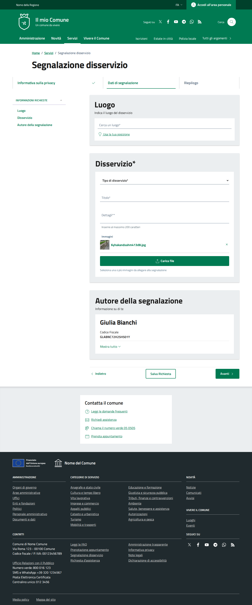
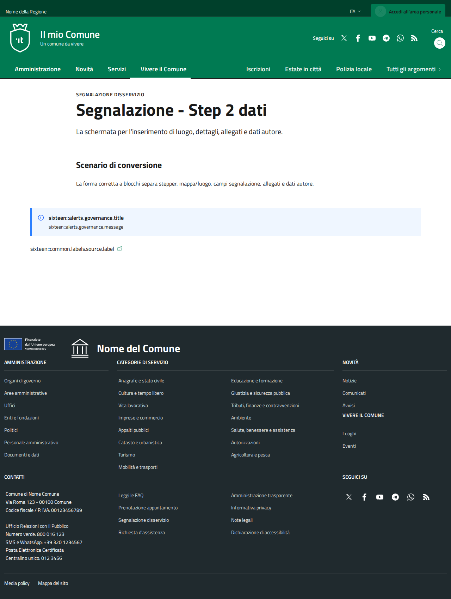
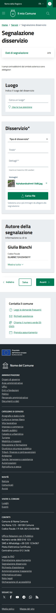
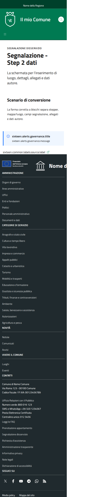

# DIFF Analysis: segnalazione-02-dati

**Data**: 2026-04-06
**Parity strutturale**: 96%
**Status**: ✅

## URL
- Reference: https://italia.github.io/design-comuni-pagine-statiche/sito/segnalazione-02-dati.html
- Local: http://127.0.0.1:8000/it/tests/segnalazione-02-dati

## Metriche HTML
| Metrica | Reference | Local |
|---------|-----------|-------|
| Righe HTML | 941 | 521 |
| Caratteri HTML | 49564 | 34534 |
| Parity strutturale | 100% | 96% |

## Screenshots
- 
- 
- 
- 

## Struttura Reference (tag principali)
```
<header class="it-header-wrapper" data-bs-target="#header-nav-wrapper" style="">
<nav aria-label="Principale">
<nav aria-label="Secondaria">
<main>
<nav class="breadcrumb-container" aria-label="breadcrumb">
<h1 class="title-xxxlarge">
<nav class="navbar it-navscroll-wrapper navbar-expand-lg" aria-label="INFORMAZIONI RICHIESTE" data-bs-navscroll="">
<section class="it-page-section" id="report-place">
<h2 class="title-xxlarge mb-1">
<section class="it-page-section" id="report-info">
<h2 class="title-xxlarge mb-3 icon-required">
<section class="it-page-section" id="report-author">
<h2 class="title-xxlarge mb-1">
<h3 class="big-title mb-0">
<h4 class="title-large-semi-bold mb-3">
<nav class="steppers-nav" aria-label="Step">
<h2 class="title-medium-2-semi-bold">
<form>
<h2>
<footer class="it-footer" id="footer">
<h2 class="no_toc">
<h4 class="footer-heading-title">
<h4 class="footer-heading-title">
<h4 class="footer-heading-title">
<h4 class="footer-heading-title">
<h4 class="footer-heading-title">
<h4 class="footer-heading-title">
```

## Struttura Local (tag principali)
```
<header class="it-header-wrapper" data-bs-target="#header-nav-wrapper" style="">
<nav aria-label="Principale">
<nav aria-label="Secondaria">
<main data-page="segnalazione-02-dati">
<section class="py-12 bg-white">
<h1 class="text-4xl md:text-5xl font-bold text-gray-900 mt-2 mb-4">
<section class="py-8 bg-white">
<h2 class="text-2xl font-bold text-gray-900 mb-4">
<h4 class="font-semibold text-blue-800">
<form>
<h2>
<footer class="it-footer" id="footer">
<h2 class="no_toc">
<h4 class="footer-heading-title">
<h4 class="footer-heading-title">
<h4 class="footer-heading-title">
<h4 class="footer-heading-title">
<h4 class="footer-heading-title">
<h4 class="footer-heading-title">
```

## Differenze rilevate

Analisi visiva basata su screenshots. Vedere REF-desktop.png vs LOCAL-desktop.png.

Da verificare:
- [ ] Header/navbar identica
- [ ] Hero/breadcrumb identico
- [ ] Contenuto principale identico
- [ ] Footer identico
- [ ] Responsive mobile corretto


## Link
- [Indice pagine](../PAGES-INDEX.md)
- [Design Comuni docs](../../design-comuni/00-index.md)
