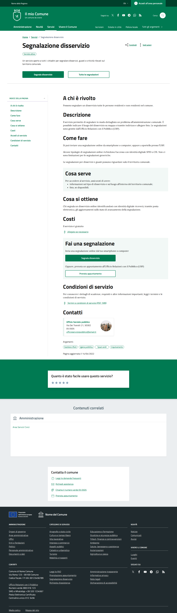
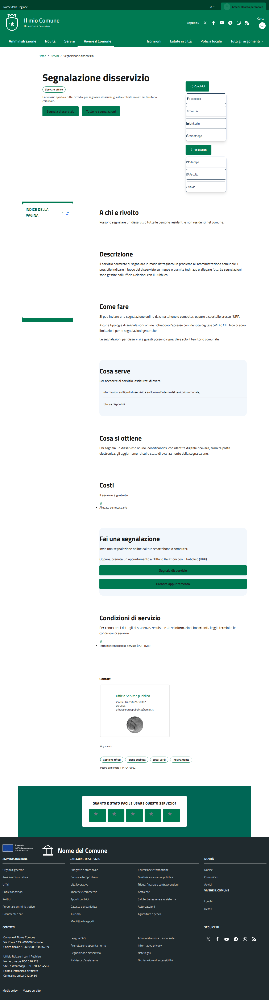

# DIFF Analysis: segnalazione-dettaglio

**Data**: 2026-04-06
**Parity strutturale**: 93%
**Status**: ✅

## URL
- Reference: https://italia.github.io/design-comuni-pagine-statiche/sito/segnalazione-dettaglio.html
- Local: http://127.0.0.1:8000/it/tests/segnalazione-dettaglio

## Metriche HTML
| Metrica | Reference | Local |
|---------|-----------|-------|
| Righe HTML | 1287 | 885 |
| Caratteri HTML | 73869 | 64466 |
| Parity strutturale | 100% | 93% |

## Screenshots
- 
- 
- 
- 

## Struttura Reference (tag principali)
```
<header class="it-header-wrapper" data-bs-target="#header-nav-wrapper" style="">
<nav aria-label="Principale">
<nav aria-label="Secondaria">
<main>
<nav class="breadcrumb-container" aria-label="breadcrumb">
<h1 class="title-xxxlarge" data-element="service-title">
<nav class="navbar it-navscroll-wrapper navbar-expand-lg" aria-label="INDICE DELLA PAGINA" data-bs-navscroll="">
<section class="it-page-section mb-30" id="who-needs">
<h2 class="title-xxlarge mb-3">
<section class="it-page-section mb-30" id="description">
<h2 class="title-xxlarge mb-3">
<section class="it-page-section mb-30" id="how-to">
<h2 class="title-xxlarge mb-3">
<section class="it-page-section mb-30 has-bg-grey p-3" id="needed">
<h2 class="title-xxlarge mb-3">
<section class="it-page-section mb-30" id="obtain">
<h2 class="title-xxlarge mb-3">
<section class="it-page-section mb-30" id="costs">
<h2 class="title-xxlarge mb-3">
<section class="it-page-section mb-30 has-bg-grey p-3" id="service-access">
<h2 class="title-xxlarge mb-3">
<section class="it-page-section mb-30" id="conditions">
<h2 class="title-xxlarge mb-3">
<section class="it-page-section" id="contacts">
<h2 class="mb-3">
<h2 class="title-medium-2-semi-bold mb-0" data-element="feedback-title">
<h2 class="title-medium-2-bold mb-0" id="rating-feedback">
<h3 class="step-title d-flex flex-column flex-lg-row align-items-lg-center justify-content-between drop-shadow">
<h3 class="step-title d-flex flex-column flex-lg-row flex-wrap align-items-lg-center justify-content-between drop-shadow
<h3 class="step-title d-flex flex-column flex-lg-row flex-wrap align-items-lg-center justify-content-between drop-shadow
```

## Struttura Local (tag principali)
```
<header class="it-header-wrapper" data-bs-target="#header-nav-wrapper" style="">
<nav aria-label="Principale">
<nav aria-label="Secondaria">
<main data-page="segnalazione-dettaglio">
<nav class="breadcrumb-container" aria-label="breadcrumb">
<h1 class="title-xxxlarge" data-element="service-title">
<nav class="navbar it-navscroll-wrapper navbar-expand-lg" aria-label="INDICE DELLA PAGINA">
<section class="it-page-section mb-30" id="who-needs">
<h2 class="title-xxlarge mb-3">
<section class="it-page-section mb-30" id="description">
<h2 class="title-xxlarge mb-3">
<section class="it-page-section mb-30" id="how-to">
<h2 class="title-xxlarge mb-3">
<section class="it-page-section mb-30 has-bg-grey p-3" id="needed">
<h2 class="title-xxlarge mb-3">
<section class="it-page-section mb-30" id="obtain">
<h2 class="title-xxlarge mb-3">
<section class="it-page-section mb-30" id="costs">
<h2 class="title-xxlarge mb-3">
<section class="it-page-section mb-30 has-bg-grey p-3" id="service-access">
<h2 class="title-xxlarge mb-3">
<section class="it-page-section mb-30" id="conditions">
<h2 class="title-xxlarge mb-3">
<section class="it-page-section" id="contacts">
<h2 class="mb-3">
<form>
<h2>
<footer class="it-footer" id="footer">
<h2 class="no_toc">
<h4 class="footer-heading-title">
```

## Differenze rilevate

Analisi visiva basata su screenshots. Vedere REF-desktop.png vs LOCAL-desktop.png.

Da verificare:
- [ ] Header/navbar identica
- [ ] Hero/breadcrumb identico
- [ ] Contenuto principale identico
- [ ] Footer identico
- [ ] Responsive mobile corretto


## Link
- [Indice pagine](../PAGES-INDEX.md)
- [Design Comuni docs](../../design-comuni/00-index.md)
