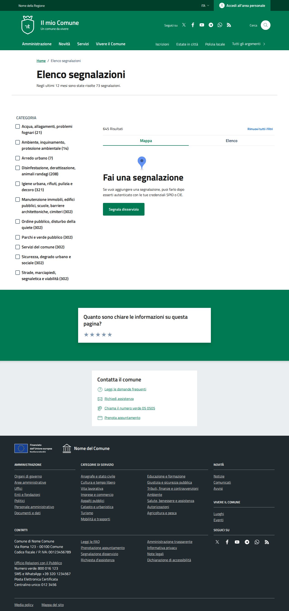
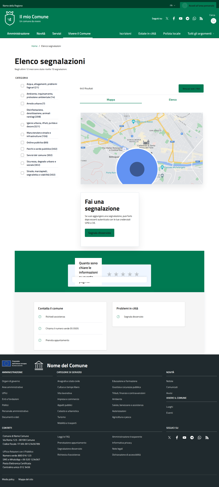
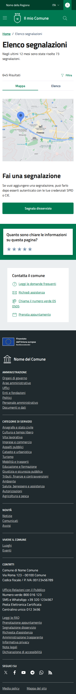
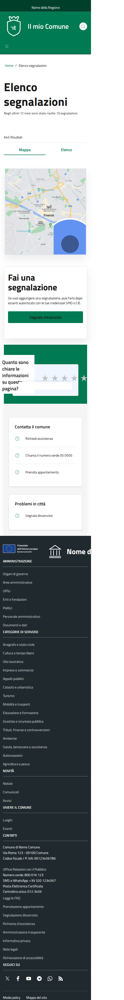

# DIFF Analysis: segnalazioni-elenco

**Data**: 2026-04-06
**Parity strutturale**: 100%
**Status**: ✅

## URL
- Reference: https://italia.github.io/design-comuni-pagine-statiche/sito/segnalazioni-elenco.html
- Local: http://127.0.0.1:8000/it/tests/segnalazioni-elenco

## Metriche HTML
| Metrica | Reference | Local |
|---------|-----------|-------|
| Righe HTML | 1351 | 1244 |
| Caratteri HTML | 76217 | 91666 |
| Parity strutturale | 100% | 100% |

## Screenshots
- 
- 
- 
- 

## Struttura Reference (tag principali)
```
<header class="it-header-wrapper" data-bs-target="#header-nav-wrapper" style="">
<nav aria-label="Principale">
<nav aria-label="Secondaria">
<main>
<nav class="breadcrumb-container" aria-label="breadcrumb">
<h1 class="title-xxxlarge">
<h2 class="title-xxlarge mb-0">
<h3 class="medium-title mb-0">
<h3 class="medium-title mb-0">
<h3 class="medium-title mb-0">
<h2 class="title-xxlarge mb-0">
<h2 class="title-medium-2-semi-bold mb-0" data-element="feedback-title">
<h2 class="title-medium-2-bold mb-0" id="rating-feedback">
<h3 class="step-title d-flex flex-column flex-lg-row align-items-lg-center justify-content-between drop-shadow">
<h3 class="step-title d-flex flex-column flex-lg-row flex-wrap align-items-lg-center justify-content-between drop-shadow
<h3 class="step-title d-flex flex-column flex-lg-row flex-wrap align-items-lg-center justify-content-between drop-shadow
<h2 class="title-medium-2-semi-bold">
<h2 class="modal-title title-small-semi-bold" id="modal2Title">
<h3 class="title-xsmall border-light pt-2">
<h3 class="title-xsmall border-light pt-2">
<h3 class="title-xsmall border-light pt-2">
<h3 class="title-xsmall border-light pt-2">
<h3 class="title-xsmall border-light pt-2">
<form>
<h2>
<footer class="it-footer" id="footer">
<h2 class="no_toc">
<h4 class="footer-heading-title">
<h4 class="footer-heading-title">
<h4 class="footer-heading-title">
```

## Struttura Local (tag principali)
```
<header class="it-header-wrapper" data-bs-target="#header-nav-wrapper" style="">
<nav aria-label="Principale">
<nav aria-label="Secondaria">
<main data-page="segnalazioni-elenco">
<nav class="breadcrumb-container" aria-label="breadcrumb">
<h1 class="title-xxxlarge">
<h2 class="title-xxlarge mb-0">
<h3 class="medium-title mb-0">
<h3 class="medium-title mb-0">
<h3 class="medium-title mb-0">
<h2 class="modal-title title-small-semi-bold">
<h3 class="title-xsmall pt-2">
<h3 class="title-xsmall pt-2">
<h3 class="title-xsmall pt-2">
<h3 class="title-xsmall pt-2">
<h2 class="modal-title title-small-semi-bold">
<h2 class="title-medium-2-semi-bold mb-0" data-element="feedback-title">
<h2 class="title-medium-2-semi-bold">
<h2 class="title-medium-2-semi-bold">
<form>
<h2>
<footer class="it-footer" id="footer">
<h2 class="no_toc">
<h4 class="footer-heading-title">
<h4 class="footer-heading-title">
<h4 class="footer-heading-title">
<h4 class="footer-heading-title">
<h4 class="footer-heading-title">
<h4 class="footer-heading-title">
```

## Differenze rilevate

Analisi visiva basata su screenshots. Vedere REF-desktop.png vs LOCAL-desktop.png.

Da verificare:
- [ ] Header/navbar identica
- [ ] Hero/breadcrumb identico
- [ ] Contenuto principale identico
- [ ] Footer identico
- [ ] Responsive mobile corretto


## Link
- [Indice pagine](../PAGES-INDEX.md)
- [Design Comuni docs](../../design-comuni/00-index.md)
