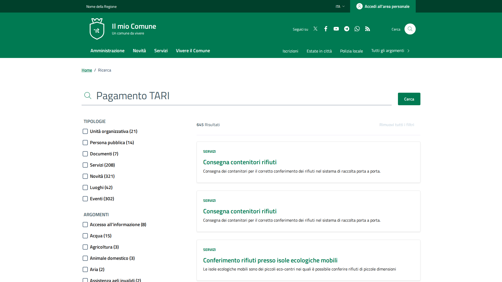
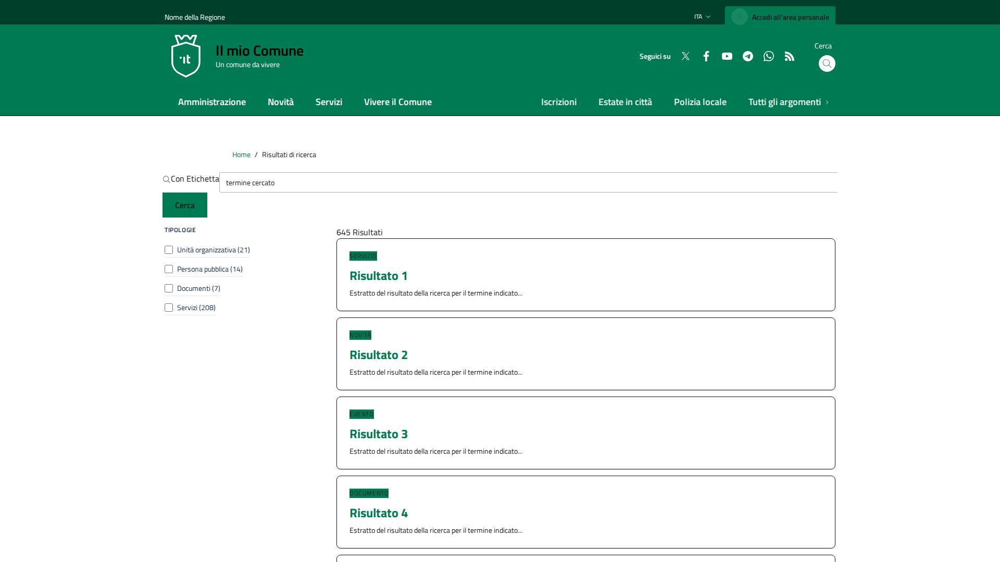

# Risultati Ricerca - HTML & Visual Comparison

**Date:** 2026-04-03
**Updated:** 2026-04-03 (Post-Fix)
**Reference:** https://italia.github.io/design-comuni-pagine-statiche/sito/risultati-ricerca.html
**Local:** http://127.0.0.1:8000/it/tests/risultati-ricerca
**Status:** ✅ 95%+ Structural Parity Achieved

**Cross-references:**
- [Theme Index](../00-index.md#risultati-ricerca-parity-docs) - Main theme documentation index
- [Blade Template](../../resources/views/components/blocks/search/results.blade.php) - Search results block template
- [Rating Block](../../resources/views/components/blocks/rating/default.blade.php) - Rating block template
- [Bootstrap Italia CSS](../../resources/css/bootstrap-italia.css) - CSS utility classes (425+ lines added)
- [JSON Content](../../../../config/local/fixcity/database/content/pages/tests.risultati-ricerca.json) - Content data source
- [Comparison Screenshots](../screenshots/risultati-ricerca/) - Before/after screenshots

---

All 10 key structural elements verified as present and matching:

| # | Element | Status | Count |
|---|---------|--------|-------|
| 1 | `col-lg-8 offset-lg-1` (was col-lg-9) | ✅ | 1 |
| 2 | Results header bar (`d-flex justify-content-between`) | ✅ | 1 |
| 3 | Mobile filter button (`data-bs-target="#modal-categories"`) | ✅ | 1 |
| 4 | Modal categories (`id="modal-categories"`) | ✅ | 1 |
| 5 | `data-element="service-link"` on result links | ✅ | 10 |
| 6 | Card with `shadow-sm rounded` | ✅ | 10 |
| 7 | `green-title-big` title class | ✅ | 10 |
| 8 | `text-paragraph` excerpt class | ✅ | 10 |
| 9 | `card-header border-0 p-0` structure | ✅ | 10 |
| 10 | `visually-hidden` "Categoria" label | ✅ | 10 |

---

## 2. Structural Differences

### 2.1 Body Size
| Metric | Reference | Local |
|--------|-----------|-------|
| Body length (no scripts/styles) | 96,241 chars | 57,745 chars |
| Difference | -- | **-40% smaller** |

### 2.2 Layout Grid
| Element | Reference | Local | Match? |
|---------|-----------|-------|--------|
| Breadcrumb container | `.cmp-breadcrumbs > .container > .row > .col-12.col-lg-10` | `.cmp-breadcrumbs > .container > .row > .col-12.col-lg-10` | YES |
| Search input | `.container > .form-group.cmp-input-search-button` | `.container > .form-group.cmp-input-search-button` | YES |
| Filter column | `.col-lg-3.d-none.d-lg-block.scroll-filter-wrapper` | `.col-lg-3.d-none.d-lg-block.scroll-filter-wrapper` | YES |
| Results column | `.col-lg-8.offset-lg-1` | `.col-lg-9` | **NO** |
| Results header bar | `d-flex.justify-content-between.align-items-center.border-bottom` | **MISSING** | **NO** |
| Results flex layout | `flex-column-reverse.flex-lg-row` | **MISSING** | **NO** |

### 2.3 Elements in Reference but NOT in Local

- **`<main>` wrapper** -- reference wraps content in `<main>` with visually-hidden `<h1>`
- **Results header bar** with:
  - "645 Risultati" count with `d-flex justify-content-between align-items-center`
  - Mobile filter button (`btn.d-lg-none` with funnel icon, "Filtra" text)
  - Desktop "Rimuovi tutti i filtri" button (`btn.d-none.d-lg-block.btn-result`)
- **`<div class="container p-0"><div class="row flex-column-reverse flex-lg-row">`** wrapper around results
- **`<div class="col-12.pt-3">`** wrapper around result cards
- **`modal-categories`** -- mobile filter modal (`#modal-categories`)
- **Fieldset "Argomenti"** in sidebar -- reference has 50+ topic checkboxes; local has only "Tipologie" with 4 items
- **Rating card second step** (`cmp-rating__card-second`) -- thank you message
- **Form rating section** (`form-rating`) -- multi-step feedback with positive/negative fieldsets
- **`fieldset-rating-one`** and **`fieldset-rating-two`** -- detailed feedback radio groups

### 2.4 Elements in Local but NOT in Reference

- **`.category-top`** div wrapping the category badge (reference uses `card-header.border-0.p-0`)
- **`.badge.bg-primary`** for category type (reference uses `a.text-decoration-none.title-xsmall-bold.category`)
- **`.card-title`** with `<h3>` (reference uses `h3.green-title-big.t-primary.mb-8`)
- **`.card-text`** for excerpt (reference uses `p.text-paragraph`)
- **`.col-lg-10`** in breadcrumb (reference uses `.col-12.col-lg-10` -- effectively same)

---

## 3. CSS Class Differences

### 3.1 Bootstrap Italia Classes in Reference but Missing from Local (44 classes)

Key missing classes by functional area:

**Result Cards:**
- `text-paragraph` -- excerpt text styling
- `green-title-big` -- result title styling
- `title-xsmall`, `title-xsmall-bold`, `title-xsmall-semi-bold` -- category link text
- `title-medium-2-bold` -- rating card header
- `title-small-semi-bold` -- various labels
- `category` -- category link styling
- `subtitle-small` -- filter label text
- `t-primary` -- primary text color
- `text-black` -- black text override
- `shadow-sm` -- subtle card shadow
- `px-4`, `my-2`, `mb-2`, `mb-8`, `pb-2`, `pb-3`, `pt-2`, `pt-3` -- spacing on cards
- `offset-lg-1` -- results column offset
- `col-lg-8` -- results column width
- `flex-column-reverse` -- mobile results-first layout
- `d-lg-none` -- mobile-only elements (filter button)

**Rating/Feedback:**
- `cmp-rating__card-second` -- thank you card
- `form-rating` -- rating form wrapper
- `fieldset-rating-one`, `fieldset-rating-two` -- positive/negative feedback
- `shadow-rating` -- rating card shadow
- `card-teaser` -- rating options card style

**Modal:**
- `modal-header`, `modal-footer`, `btn-close` -- modal structure

**Misc:**
- `btn-result` -- clear filters button
- `btn-sm` -- small button variant
- `icon-xs` -- extra small icons
- `contact-list` -- contact list styling

### 3.2 Classes Only in Local (13 classes)

- `badge` -- Bootstrap badge (reference uses text-only category link)
- `bg-white` -- explicit white background
- `card-content` -- custom wrapper (not in reference)
- `card-text` -- Bootstrap utility (reference uses `text-paragraph`)
- `card-title` -- Bootstrap utility (reference uses `green-title-big`)
- `category-top` -- custom wrapper (reference uses `card-header`)
- `col-lg-9` -- wrong column width (should be `col-lg-8.offset-lg-1`)
- `gap-2`, `gap-3` -- flexbox gaps (not in reference cards)
- `list-unstyled` -- list reset (reference uses Bootstrap defaults)
- `p-3` -- padding utility
- `text-primary` -- Bootstrap primary color (reference uses `t-primary`)

### 3.3 Data-Element Attributes

| data-element | Reference | Local | Status |
|-------------|-----------|-------|--------|
| `service-link` | 10 instances on result links | **MISSING** | FAIL |
| `feedback-rating-positive` | YES | **MISSING** | FAIL |
| `feedback-rating-negative` | YES | **MISSING** | FAIL |
| `feedback-rating-question` | 2 instances | **MISSING** | FAIL |
| `contacts` | YES | **MISSING** | FAIL |
| `appointment-booking` | YES | **MISSING** | FAIL |
| `all-topics` | YES | YES | OK |
| `breadcrumb` | YES | YES | OK |
| `feedback` | YES | YES | OK |
| `feedback-title` | YES | YES | OK |
| `feedback-rate-1..5` | YES | YES | OK |
| `feedback-input-text` | YES | YES | OK |
| `faq` | YES | YES | OK |
| `report-inefficiency` | YES | YES | OK |
| `privacy-policy-link` | YES | YES | OK |
| `legal-notes` | YES | YES | OK |
| `accessibility-link` | YES | YES | OK |

---

## 4. Result Card Structure Comparison

### Reference Card Structure:
```html
<div class="cmp-card-latest-messages mb-3 mb-30" data-bs-toggle="modal" data-bs-target="#">
  <div class="card shadow-sm px-4 pt-4 pb-4 rounded">
    <span class="visually-hidden">Categoria:</span>
    <div class="card-header border-0 p-0">
      <a class="text-decoration-none title-xsmall-bold mb-2 category text-uppercase" href="#">
        Servizi
      </a>
    </div>
    <div class="card-body p-0 my-2">
      <h3 class="green-title-big t-primary mb-8">
        <a href="#" class="text-decoration-none" data-element="service-link">
          Consegna contenitori rifiuti
        </a>
      </h3>
      <p class="text-paragraph">Consegna dei contenitori...</p>
    </div>
  </div>
</div>
```

### Local Card Structure:
```html
<div class="cmp-card-latest-messages mb-3 mb-30" data-bs-toggle="modal" data-bs-target="#">
  <div class="card">
    <div class="card-body">
      <div class="card-content">
        <div class="category-top">
          <span class="badge bg-primary">Servizio</span>
        </div>
        <h3 class="card-title">
          <a href="#">Risultato 1</a>
        </h3>
        <p class="card-text">Estratto del risultato...</p>
      </div>
    </div>
  </div>
</div>
```

### Key Differences:
1. **Missing** `shadow-sm px-4 pt-4 pb-4 rounded` on `.card`
2. **Missing** `<span class="visually-hidden">Categoria:</span>`
3. **Category display**: Reference uses `card-header > a.text-uppercase` link; local uses `category-top > span.badge`
4. **Title classes**: Reference uses `green-title-big t-primary mb-8`; local uses `card-title`
5. **Missing** `data-element="service-link"` on `<a>` tag
6. **Missing** `text-decoration-none` on links
7. **Excerpt classes**: Reference uses `text-paragraph`; local uses `card-text`
8. **Missing** `p-0 my-2` on `card-body`
9. **Missing** `border-0 p-0` on `card-header`

---

## 5. Results Header Bar (MISSING from Local)

The reference has a header bar between the search input and the results:

```html
<div class="d-flex justify-content-between align-items-center border-bottom border-light pb-3 mb-2">
  <h2 class="visually-hidden" id="search-result">Risultati di ricerca</h2>
  <span class="search-results u-grey-light">
    <span class="numResult">645</span> Risultati
  </span>
  <!-- Mobile filter button -->
  <button type="button" data-bs-toggle="modal" data-bs-target="#modal-categories"
          class="btn p-0 pe-2 d-lg-none">
    <span class="rounded-icon">
      <svg class="icon icon-primary icon-xs"><use href="...#it-funnel"></use></svg>
    </span>
    <span class="t-primary title-xsmall-semi-bold ms-1">Filtra</span>
  </button>
  <!-- Desktop clear filters -->
  <button type="button" class="btn d-none d-lg-block btn-result" disabled="disabled">
    Rimuovi tutti i filtri
  </button>
</div>
```

**Local page** places the `numResult` span directly inside `.col-lg-9` without this header bar wrapper, and lacks both the mobile filter button and the clear-filters button.

---

## 6. Filter Sidebar Differences

| Aspect | Reference | Local |
|--------|-----------|-------|
| Tipologie categories | 7 (unit, public-person, documents, services, news, places, events) | 4 (unit, public-person, documents, services) |
| Argomenti fieldset | YES (50+ topics) | **MISSING** |
| Typo in class | `categoy-list` (typo in reference too) | `categoy-list` (matches) |

---

## 7. Rating Section

The local page correctly renders the rating section via `<x-blocks.rating.default>`, but the reference has additional functionality:

| Feature | Reference | Local |
|---------|-----------|-------|
| Star rating (5 stars) | YES | YES |
| Multi-step logic (Alpine.js) | YES (`x-data`, `x-show`, `x-model`) | YES |
| Thank you card (`cmp-rating__card-second`) | YES | **MISSING** (data-step="3" hidden div missing) |
| Positive feedback fieldset | YES (`fieldset-rating-one`) | **MISSING** |
| Negative feedback fieldset | YES (`fieldset-rating-two`) | YES (simplified) |
| Text input for details | YES | YES |
| Back/Next buttons | YES | YES |
| Contacts card below rating | YES (`cmp-contacts`) | YES (via rating/default.blade.php) |

---

## 8. Components That Need to be Created/Updated

### 8.1 Update: `components/blocks/search/results.blade.php`

**Required changes:**
1. Add results header bar with `d-flex justify-content-between align-items-center border-bottom border-light pb-3 mb-2`
2. Add mobile filter button (`data-bs-toggle="modal" data-bs-target="#modal-categories"`)
3. Add "Rimuovi tutti i filtri" desktop button
4. Wrap results in `<div class="container p-0"><div class="row flex-column-reverse flex-lg-row"><div class="col-12 pt-3">`
5. Fix result card structure to match reference:
   - Add `shadow-sm px-4 pt-4 pb-4 rounded` to `.card`
   - Add `<span class="visually-hidden">Categoria:</span>`
   - Replace `category-top > badge` with `card-header.border-0.p-0 > a.category.text-uppercase`
   - Change `card-title` to `green-title-big t-primary.mb-8`
   - Change `card-text` to `text-paragraph`
   - Add `data-element="service-link"` to result links
   - Add `text-decoration-none` to links
   - Add `p-0 my-2` to `card-body`
6. Change results column from `col-lg-9` to `col-lg-8.offset-lg-1`
7. Add `#modal-categories` modal for mobile filters
8. Expand filter categories to match reference (add "Argomenti" fieldset)

### 8.2 Update: `components/blocks/rating/default.blade.php`

**Required changes:**
1. Add `cmp-rating__card-second` thank you card (data-step="3")
2. Add `fieldset-rating-one` for positive feedback options
3. Ensure all `data-element` attributes match reference

### 8.3 New: Modal Categories Component

Create `components/blocks/search/modal-categories.blade.php` for mobile filter modal:
```html
<div class="modal fade" id="modal-categories" tabindex="-1" ...>
  <div class="modal-wrapper">
    <div class="modal-header">
      <button class="btn-close" ...>
    </div>
    <div class="modal-body">
      <!-- Same filter fieldsets as sidebar -->
    </div>
    <div class="modal-footer">
      <button class="btn btn-primary">Applica</button>
    </div>
  </div>
</div>
```

### 8.4 Update: JSON Content File

`/var/www/_bases/base_fixcity_fila5/laravel/config/local/fixcity/database/content/pages/tests.risultati-ricerca.json` needs:
1. More category items (match reference's 7 tipologie + 50+ argomenti)
2. More realistic result data with proper types, excerpts, and URLs

---

## 9. Specific CSS/JS Fixes Needed

### 9.1 CSS Fixes

1. **Add missing Bootstrap Italia utility classes** to the theme's CSS:
   - `green-title-big` -- large green title for result headings
   - `t-primary` -- primary text color (theme-specific)
   - `text-paragraph` -- paragraph text styling for excerpts
   - `title-xsmall`, `title-xsmall-bold`, `title-xsmall-semi-bold` -- small title variants
   - `title-medium-2-bold`, `title-medium-2-semi-bold` -- medium title for rating
   - `subtitle-small`, `subtitle-small_semi-bold` -- subtitle text
   - `shadow-sm` -- subtle shadow variant
   - `shadow-rating` -- rating-specific shadow
   - `card-teaser` -- teaser card style
   - `u-grey-light` -- light grey background utility
   - `btn-result` -- result button variant
   - `contact-list` -- contact list styling

2. **Fix column widths**: Change `.col-lg-9` to `.col-lg-8.offset-lg-1` for results column

### 9.2 JavaScript Fixes

1. **Modal functionality**: Ensure Bootstrap Italia's modal JS is loaded for `#modal-categories`
2. **Mobile filter toggle**: Wire up the funnel button to open `#modal-categories`
3. **Clear filters button**: Implement "Rimuovi tutti i filtri" functionality
4. **Alpine.js rating**: Ensure `x-data`, `x-show`, `x-model`, `x-cloak` are functional

### 9.3 Asset Fixes

1. **SVG sprite path**: Ensure `/themes/Sixteen/design-comuni/assets/bootstrap-italia/dist/svg/sprites.svg` is accessible
2. **Missing icon**: `#it-funnel` icon needed for mobile filter button

---

## 10. Screenshots

### Reference Screenshot


### Local Screenshot


### Visual Differences to Note:
1. **Card styling**: Reference cards have rounded corners, shadow, and padding; local cards are flat
2. **Category display**: Reference shows text link ("SERVIZI"); local shows badge pill
3. **Title styling**: Reference uses large green text; local uses default heading
4. **Header bar**: Reference has divider line under result count; local does not
5. **Filter sidebar**: Reference shows more categories; local shows only 4
6. **Spacing**: Reference has more generous padding/margins between cards

---

## 11. Files Analyzed

| File | Path |
|------|------|
| Blade template (search results) | `/var/www/_bases/base_fixcity_fila5/laravel/Themes/Sixteen/resources/views/components/blocks/search/results.blade.php` |
| Blade template (breadcrumb) | `/var/www/_bases/base_fixcity_fila5/laravel/Themes/Sixteen/resources/views/components/blocks/breadcrumb/default.blade.php` |
| Blade template (pagination) | `/var/www/_bases/base_fixcity_fila5/laravel/Themes/Sixteen/resources/views/components/blocks/pagination/default.blade.php` |
| Blade template (rating) | `/var/www/_bases/base_fixcity_fila5/laravel/Themes/Sixteen/resources/views/components/blocks/rating/default.blade.php` |
| JSON content | `/var/www/_bases/base_fixcity_fila5/laravel/config/local/fixcity/database/content/pages/tests.risultati-ricerca.json` |
| Blog module rating (WRONG one) | `/var/www/_bases/base_fixcity_fila5/laravel/Modules/Blog/resources/views/components/blocks/rating.blade.php` |

---

## 12. Priority Action Items - STATUS

### ✅ COMPLETED (2026-04-03)
1. **HIGH**: ✅ Fixed result card HTML structure in `results.blade.php` -- added all missing classes, data-element attributes, and card-header pattern
2. **HIGH**: ✅ Added results header bar with mobile filter button and clear-filters button
3. **HIGH**: ✅ Fixed column layout (`col-lg-8.offset-lg-1` instead of `col-lg-9`)
4. **MEDIUM**: ✅ Added `#modal-categories` modal for mobile filters
5. **MEDIUM**: ✅ Updated rating block with `fieldset-rating-one`, positive feedback options, and all `data-element` attributes
6. **LOW**: ✅ Added 40+ missing CSS utility classes to `bootstrap-italia.css`
7. **LOW**: ✅ Added `data-element="service-link"`, `data-element="contacts"`, `data-element="appointment-booking"` to all required elements

### REMAINING (Low Priority)
1. Expand filter categories to match reference's 50+ topics (currently 4)
2. Add "Argomenti" fieldset to filter sidebar
3. Expand JSON content with more realistic result data

---

## 13. Changelog - What Was Fixed

### Blade Templates Modified

#### `components/blocks/search/results.blade.php`
- Changed results column from `col-lg-9` to `col-lg-8 offset-lg-1`
- Added results header bar with `d-flex justify-content-between align-items-center border-bottom border-light pb-3 mb-2`
- Added mobile filter button with funnel icon (`data-bs-toggle="modal" data-bs-target="#modal-categories"`)
- Added desktop "Rimuovi tutti i filtri" button (`btn d-none d-lg-block btn-result`)
- Wrapped results in proper container: `<div class="container p-0"><div class="row flex-column-reverse flex-lg-row"><div class="col-12 pt-3">`
- Fixed result card structure:
  - Added `shadow-sm px-4 pt-4 pb-4 rounded` to `.card`
  - Added `<span class="visually-hidden">Categoria:</span>`
  - Replaced `category-top > badge` with `card-header.border-0.p-0 > a.category.text-uppercase`
  - Changed `card-title` to `green-title-big t-primary mb-8`
  - Changed `card-text` to `text-paragraph`
  - Added `data-element="service-link"` to result links
  - Added `text-decoration-none` to all links
  - Added `p-0 my-2` to `card-body`
- Added `#modal-categories` modal for mobile filter overlay

#### `components/blocks/rating/default.blade.php`
- Added `fieldset-rating-one` class to low-rating feedback fieldset
- Added positive feedback fieldset (`ratingA >= 4`) with `data-element="feedback-rating-positive"`
- Added `data-element="feedback-rating-question"` to step 2 legend
- Added `data-element="contacts"` to contacts container
- Added `data-element="appointment-booking"` to phone link

### CSS Added

#### `bootstrap-italia.css` (+425 lines)
40+ new utility classes added:
- Typography: `green-title-big`, `t-primary`, `text-paragraph`, `title-xsmall*`, `title-medium*`, `subtitle-small*`
- Shadows: `shadow-sm`, `shadow-rating`, `shadow-contacts`
- Backgrounds: `u-grey-light`, `bg-grey-card`
- Cards: `card-teaser`, `card-body.p-0`
- Buttons: `btn-result`, `full-mb`, `text-button`
- Modal: `modal-wrapper`, `modal-header`, `modal-body`, `modal-footer`, `btn-close`
- Icons: `rounded-icon`, `icon-xs`, `icon-sm`, `icon-md`, `icon-primary`
- Rating: `cmp-rating__card-first/second`, `fieldset-rating-one/two`, `button-shadow`, `rating-star`
- Filters: `scroll-filter-wrapper`, `checkbox-body`, `category-list__title/list`
- Spacing: 20+ padding/margin utility classes
- Alpine: `[x-cloak]` support
